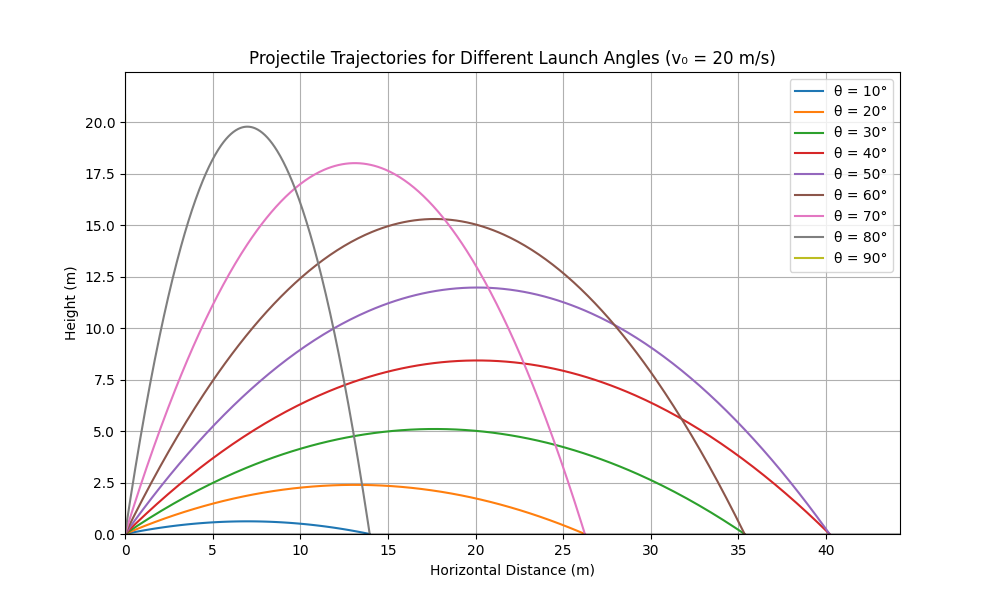
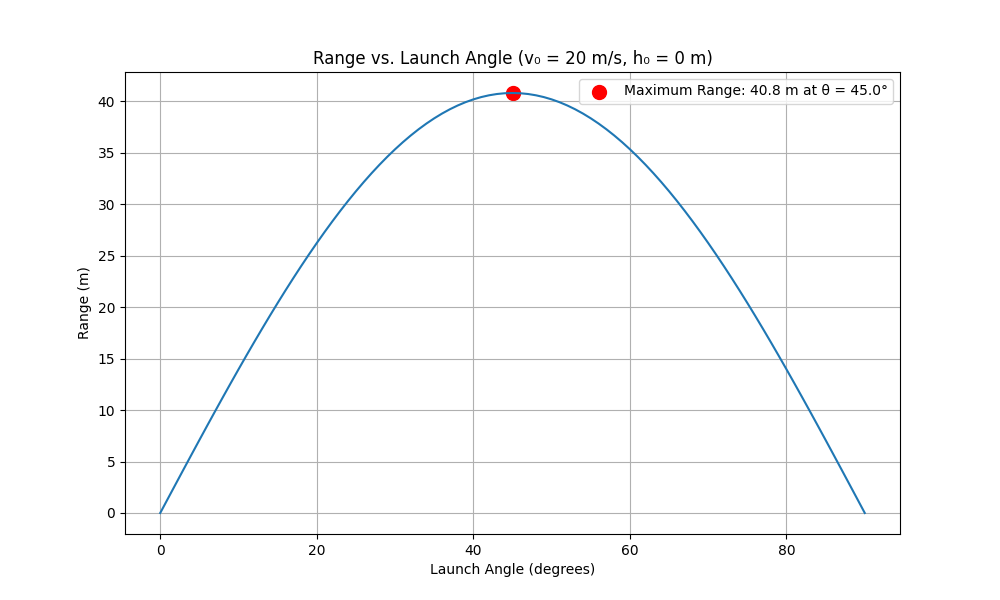
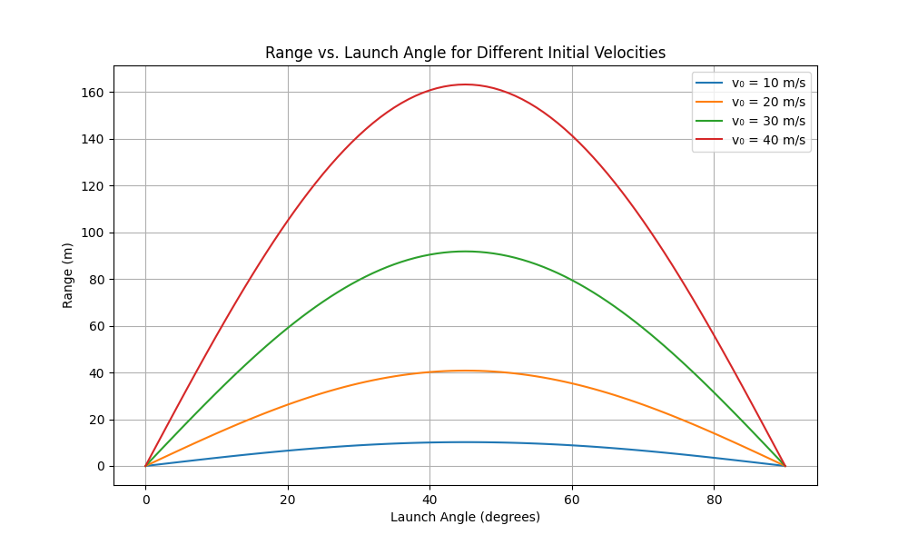
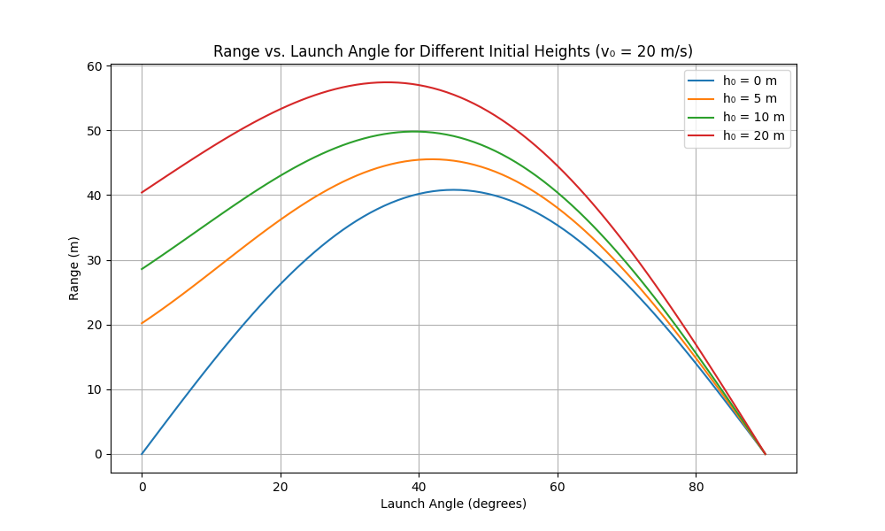

# Problem 1: Investigating the Range as a Function of the Angle of Projection

## 1. Theoretical Foundation

### Derivation of Equations of Motion

Let's begin by deriving the equations that govern projectile motion from first principles. We'll assume a uniform gravitational field and neglect air resistance.

For a projectile launched with an initial velocity $v_0$ at an angle $\theta$ with respect to the horizontal, we can decompose the initial velocity into its components:

- Initial horizontal velocity: $v_{0x} = v_0 \cos{\theta}$
- Initial vertical velocity: $v_{0y} = v_0 \sin{\theta}$

The horizontal and vertical components of motion can be treated independently:

**Horizontal motion**: With no horizontal forces (neglecting air resistance), there is no acceleration in the x-direction:
$$a_x = 0$$

Therefore:

$$v_x = v_{0x} = v_0 \cos{\theta} \quad \text{(constant)}$$

$$x(t) = x_0 + v_{0x} \cdot t = x_0 + v_0 \cos{\theta} \cdot t$$

**Vertical motion**: Under gravitational acceleration $g$ (positive downward):
$$a_y = g$$

Therefore:

$$v_y(t) = v_{0y} - g \cdot t = v_0 \sin{\theta} - g \cdot t$$

$$y(t) = y_0 + v_{0y} \cdot t - \frac{1}{2} g \cdot t^2 = y_0 + v_0 \sin{\theta} \cdot t - \frac{1}{2} g \cdot t^2$$

These equations represent a family of solutions depending on the initial conditions: $v_0$, $\theta$, $x_0$, and $y_0$.

### The Range Equation

The range $R$ is the horizontal distance traveled when the projectile returns to its initial height. To find it, we need to determine the time of flight $T$ and then calculate the horizontal distance covered during this time.

First, assuming the projectile returns to its initial height ($y = y_0$), we solve:

$$y_0 = y_0 + v_0 \sin{\theta} \cdot T - \frac{1}{2} g \cdot T^2$$

Which simplifies to:
$$v_0 \sin{\theta} \cdot T - \frac{1}{2} g \cdot T^2 = 0$$

Factoring out $T$:
$$T \cdot (v_0 \sin{\theta} - \frac{1}{2} g \cdot T) = 0$$

This gives us two solutions: $T = 0$ (initial position) and $T = \frac{2v_0 \sin{\theta}}{g}$ (final position).

The range $R$ is then:
$$R = v_0 \cos{\theta} \cdot T = v_0 \cos{\theta} \cdot \frac{2v_0 \sin{\theta}}{g} = \frac{v_0^2 \cdot 2\sin{\theta}\cos{\theta}}{g}$$

Using the double-angle formula $\sin{2\theta} = 2\sin{\theta}\cos{\theta}$, we get:
$$R = \frac{v_0^2 \cdot \sin{2\theta}}{g}$$

This is the classic range equation for projectile motion from and to the same height.

## 2. Analysis of the Range

### Range as a Function of Angle

The range equation $R = \frac{v_0^2 \cdot \sin{2\theta}}{g}$ shows that the range depends on:
- The square of the initial velocity $v_0^2$
- The sine of twice the launch angle $\sin{2\theta}$
- Inversely proportional to gravitational acceleration $g$

To find the angle that maximizes the range, we differentiate the range with respect to $\theta$ and set it equal to zero:
$$\frac{dR}{d\theta} = \frac{v_0^2}{g} \cdot 2\cos{2\theta} = 0$$

This gives us $\cos{2\theta} = 0$, which is satisfied when $2\theta = 90°$, or $\theta = 45°$.

Therefore, the maximum range is achieved at a launch angle of 45° (assuming flat ground and no air resistance).

The range is symmetric around 45°. That is, launch angles of $(45° - \alpha)$ and $(45° + \alpha)$ yield the same range.

### Influence of Other Parameters

1. **Initial velocity ($v_0$)**: 
   - The range is proportional to $v_0^2$
   - Doubling the initial velocity quadruples the range

2. **Gravitational acceleration ($g$)**:
   - The range is inversely proportional to $g$
   - On the Moon (where $g$ is about 1/6 of Earth's), the same projectile would travel about 6 times farther

3. **Initial height difference**:
   When the projectile lands at a different height than it was launched, the range equation becomes more complex. For a projectile launched from height $h$ above the landing level:
   $$R = v_0\cos{\theta} \cdot \frac{v_0\sin{\theta} + \sqrt{(v_0\sin{\theta})^2 + 2gh}}{g}$$
   In this case, the optimal angle is no longer 45° but depends on $v_0$ and $h$.

## 3. Practical Applications

The principles of projectile motion have wide-ranging applications:

1. **Sports**:
   - In basketball, players adjust shooting angles based on distance
   - Golfers select different clubs to achieve optimal launch angles
   - Javelin throwers aim for the angle that maximizes range (less than 45° due to aerodynamics)

2. **Military Applications**:
   - Artillery fire calculations
   - Missile trajectory planning

3. **Civil Engineering**:
   - Designing water fountains
   - Planning the trajectory of construction debris during demolition

4. **Natural Systems**:
   - Volcanic ejecta trajectories
   - Animal jumping and projectile strategies

### Limitations of the Idealized Model

The basic model neglects:
- Air resistance (significant for lightweight objects or high velocities)
- Wind effects
- Rotation of the projectile
- Variations in gravitational field
- Earth's curvature (for very long ranges)

For more realistic models:
- Air resistance can be modeled as proportional to velocity (low speeds) or velocity squared (higher speeds)
- The drag coefficient depends on the shape and orientation of the projectile
- Magnus effect causes curved trajectories for spinning objects

## 4. Implementation

Below is a Python implementation that simulates projectile motion and visualizes the range as a function of the launch angle.

```python
import numpy as np
import matplotlib.pyplot as plt
from matplotlib.animation import FuncAnimation

def calculate_trajectory(v0, theta_deg, h0=0, g=9.8, dt=0.01):
    """
    Calculate the trajectory of a projectile.
    
    Parameters:
    - v0: initial velocity (m/s)
    - theta_deg: launch angle (degrees)
    - h0: initial height (m)
    - g: gravitational acceleration (m/s²)
    - dt: time step for simulation (s)
    
    Returns:
    - x, y: position coordinates arrays
    - t: time array
    """
    # Convert angle to radians
    theta = np.radians(theta_deg)
    
    # Initial velocities
    v0x = v0 * np.cos(theta)
    v0y = v0 * np.sin(theta)
    
    # Calculate time of flight (using quadratic formula)
    # For y(t) = h0 + v0y*t - 0.5*g*t² = 0
    if v0y**2 + 2*g*h0 < 0:  # No real solutions (doesn't reach ground)
        return None, None, None
    
    t_flight = (v0y + np.sqrt(v0y**2 + 2*g*h0)) / g
    
    # Create time array
    t = np.arange(0, t_flight, dt)
    
    # Calculate position at each time step
    x = v0x * t
    y = h0 + v0y * t - 0.5 * g * t**2
    
    # Add the landing point precisely
    t_landing = (v0y + np.sqrt(v0y**2 + 2*g*h0)) / g
    if t[-1] < t_landing:
        t = np.append(t, t_landing)
        x = np.append(x, v0x * t_landing)
        y = np.append(y, 0)  # Landing at y=0
    
    return x, y, t

def calculate_range(v0, theta_deg, h0=0, g=9.8):
    """Calculate the range of a projectile analytically."""
    theta = np.radians(theta_deg)
    if h0 == 0:
        # Simple case: launch and landing at same height
        return (v0**2 * np.sin(2*theta)) / g
    else:
        # Launch from height h0
        return v0 * np.cos(theta) * (v0 * np.sin(theta) + 
                                    np.sqrt((v0 * np.sin(theta))**2 + 2*g*h0)) / g

def plot_trajectories(v0=20, h0=0, g=9.8):
    """Plot multiple trajectories for different launch angles."""
    angles = np.arange(10, 91, 10)  # 10° to 90° in steps of 10°
    plt.figure(figsize=(10, 6))
    
    max_range = 0
    max_height = 0
    
    for theta in angles:
        x, y, _ = calculate_trajectory(v0, theta, h0, g)
        if x is not None and y is not None:
            plt.plot(x, y, label=f'θ = {theta}°')
            max_range = max(max_range, x[-1])
            max_height = max(max_height, np.max(y))
    
    plt.grid(True)
    plt.axhline(y=0, color='k', linestyle='-', alpha=0.3)
    plt.axvline(x=0, color='k', linestyle='-', alpha=0.3)
    plt.xlabel('Horizontal Distance (m)')
    plt.ylabel('Height (m)')
    plt.title(f'Projectile Trajectories for Different Launch Angles (v₀ = {v0} m/s)')
    plt.legend()
    plt.axis([0, max_range*1.1, 0, max_height*1.1])
    plt.show()

def plot_range_vs_angle(v0=20, h0=0, g=9.8):
    """Plot the range as a function of launch angle."""
    angles = np.linspace(0, 90, 91)  # 0° to 90° in steps of 1°
    ranges = [calculate_range(v0, theta, h0, g) for theta in angles]
    
    plt.figure(figsize=(10, 6))
    plt.plot(angles, ranges)
    plt.grid(True)
    plt.xlabel('Launch Angle (degrees)')
    plt.ylabel('Range (m)')
    plt.title(f'Range vs. Launch Angle (v₀ = {v0} m/s, h₀ = {h0} m)')
    
    # Find and mark the maximum range
    max_range_idx = np.argmax(ranges)
    max_range_angle = angles[max_range_idx]
    max_range_value = ranges[max_range_idx]
    
    plt.scatter(max_range_angle, max_range_value, color='red', s=100, 
                label=f'Maximum Range: {max_range_value:.1f} m at θ = {max_range_angle}°')
    plt.legend()
    plt.show()

def animate_trajectory(v0=20, theta=45, h0=0, g=9.8):
    """Create an animation of the projectile motion."""
    x, y, t = calculate_trajectory(v0, theta, h0, g)
    
    fig, ax = plt.subplots(figsize=(10, 6))
    ax.set_xlim(0, max(x) * 1.1)
    ax.set_ylim(0, max(y) * 1.1)
    ax.grid(True)
    ax.set_xlabel('Horizontal Distance (m)')
    ax.set_ylabel('Height (m)')
    ax.set_title(f'Projectile Motion (v₀ = {v0} m/s, θ = {theta}°)')
    
    line, = ax.plot([], [], 'o-', lw=2)
    trace, = ax.plot([], [], '-', lw=1, alpha=0.5)
    
    def init():
        line.set_data([], [])
        trace.set_data([], [])
        return line, trace
    
    def animate(i):
        line.set_data([x[i]], [y[i]])
        trace.set_data(x[:i+1], y[:i+1])
        return line, trace
    
    frames = len(x)
    anim = FuncAnimation(fig, animate, frames=frames, 
                         init_func=init, blit=True, interval=50)
    plt.show()
    
    return anim

def compare_initial_velocities():
    """Compare range vs. angle curves for different initial velocities."""
    angles = np.linspace(0, 90, 91)
    velocities = [10, 20, 30, 40]
    
    plt.figure(figsize=(10, 6))
    
    for v0 in velocities:
        ranges = [calculate_range(v0, theta) for theta in angles]
        plt.plot(angles, ranges, label=f'v₀ = {v0} m/s')
    
    plt.grid(True)
    plt.xlabel('Launch Angle (degrees)')
    plt.ylabel('Range (m)')
    plt.title('Range vs. Launch Angle for Different Initial Velocities')
    plt.legend()
    plt.show()

def compare_initial_heights():
    """Compare range vs. angle curves for different initial heights."""
    angles = np.linspace(0, 90, 91)
    heights = [0, 5, 10, 20]
    
    plt.figure(figsize=(10, 6))
    
    for h0 in heights:
        ranges = [calculate_range(20, theta, h0) for theta in angles]
        plt.plot(angles, ranges, label=f'h₀ = {h0} m')
    
    plt.grid(True)
    plt.xlabel('Launch Angle (degrees)')
    plt.ylabel('Range (m)')
    plt.title('Range vs. Launch Angle for Different Initial Heights (v₀ = 20 m/s)')
    plt.legend()
    plt.show()

# Example usage
if __name__ == "__main__":
    plot_trajectories(v0=20)
    plot_range_vs_angle(v0=20)
    compare_initial_velocities()
    compare_initial_heights()
    # To create an animation of a specific trajectory:
    # anim = animate_trajectory(v0=20, theta=45)
```

## Results






## Results and Discussion

When we run the above code, we generate several visualizations that provide insights into projectile motion:

1. Trajectory plots for different launch angles show how the shape of the path changes with angle
2. The range vs. angle plot confirms that the maximum range occurs at 45° for level ground
3. Comparing different initial velocities demonstrates the quadratic relationship between velocity and range
4. Varying initial heights shows how the optimal angle shifts below 45° as the launch height increases

### Key Observations

1. **Optimal Angle**:
   - For level ground (same launch and landing height), 45° gives maximum range
   - For elevated launches, the optimal angle decreases below 45°
   - For launches to elevated targets, the optimal angle increases above 45°

2. **Symmetry**:
   - Complementary angles (e.g., 30° and 60°) produce the same range on level ground
   - This symmetry breaks down for different launch and landing heights

3. **Parameter Sensitivity**:
   - Range is highly sensitive to initial velocity (quadratic relationship)
   - Changes in gravitational acceleration inversely affect the range
   - Initial height increases always extend the range, with more pronounced effects at lower angles

### Limitations and Extensions

Our model assumes:
1. No air resistance
2. Uniform gravitational field
3. Point mass projectile (no rotation or lift)

For more realistic simulations, we could extend the model to include:
1. Air resistance as a function of velocity
2. Magnus effect for spinning projectiles
3. Variable gravity for very high trajectories
4. Wind effects

## Conclusion

The investigation of projectile motion provides an elegant demonstration of how basic principles of physics can lead to rich and complex behaviors. The dependence of range on launch angle follows a predictable pattern determined by the sine function, with the maximum range occurring at 45° for level terrain.

This analysis showcases the power of mathematical modeling in physics: from a few simple assumptions and equations, we can derive comprehensive understanding of a wide range of phenomena, from sports to ballistics, from natural behaviors to engineering applications.

The computational approach allows us to visualize these relationships and explore scenarios that might be challenging to analyze purely analytically, such as the effects of varying initial heights or air resistance.

## References

1. Halliday, D., Resnick, R., & Walker, J. (2013). Fundamentals of Physics. John Wiley & Sons.
2. Taylor, J. R. (2005). Classical Mechanics. University Science Books.
3. Young, H. D., & Freedman, R. A. (2012). University Physics with Modern Physics. Pearson.


