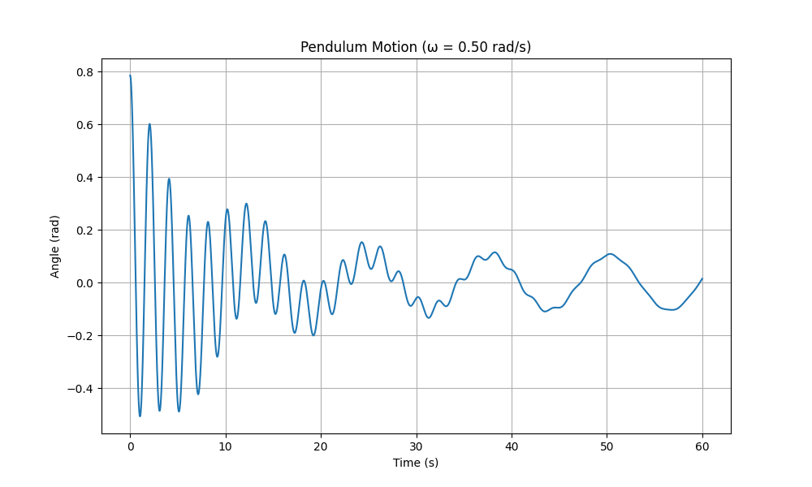
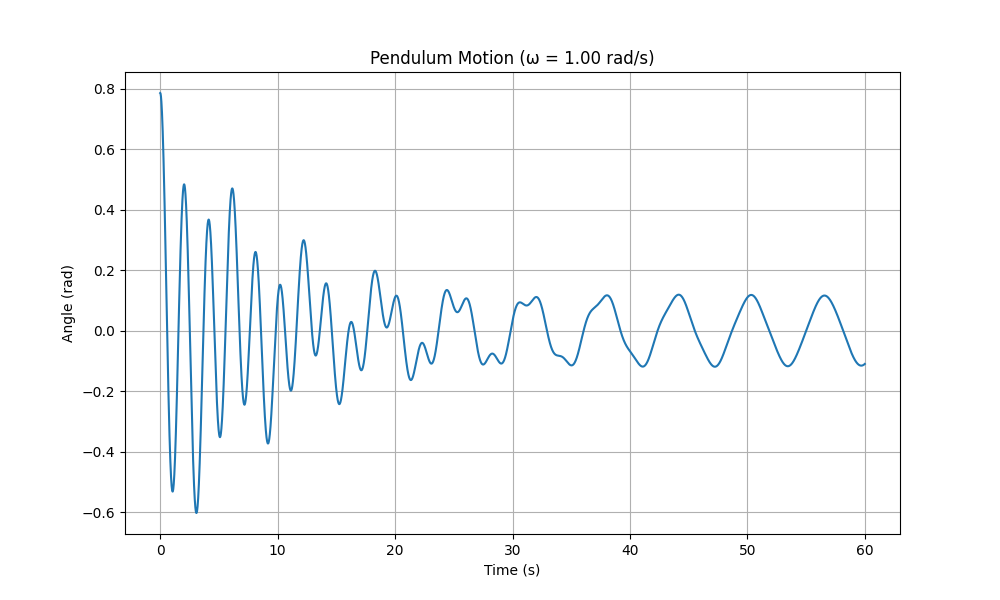
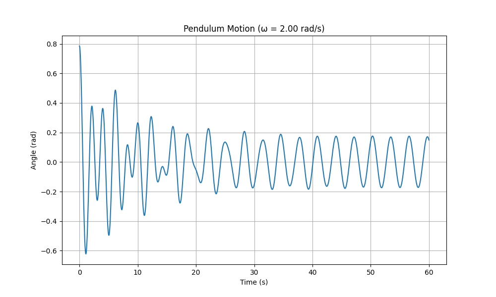
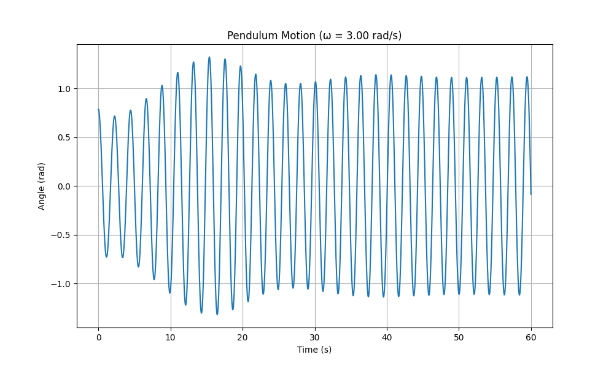

# Problem 2: Investigating the Dynamics of a Forced Damped Pendulum

## 1. Theoretical Foundation

### The Governing Equation

The motion of a forced damped pendulum is described by the following differential equation:

$$\frac{d^2\theta}{dt^2} + b\frac{d\theta}{dt} + \frac{g}{L}\sin\theta = A\cos(\omega t)$$

Where:
- $\theta$ is the angular displacement
- $t$ is time
- $b$ is the damping coefficient
- $g$ is the acceleration due to gravity
- $L$ is the length of the pendulum
- $A$ is the amplitude of the driving force
- $\omega$ is the angular frequency of the driving force

### Small-Angle Approximation

For small oscillations ($\theta \ll 1$ radian), we can approximate $\sin\theta \approx \theta$, which simplifies the equation to:

$$\frac{d^2\theta}{dt^2} + b\frac{d\theta}{dt} + \frac{g}{L}\theta = A\cos(\omega t)$$

This is a linear second-order differential equation with constant coefficients. The general solution consists of two parts:
1. The complementary function (transient response)
2. The particular integral (steady-state response)

### Solution for Small Oscillations

The complementary function represents the unforced damped oscillations and takes the form:

$$\theta_c(t) = e^{-\frac{b}{2}t}(C_1\cos(\omega_d t) + C_2\sin(\omega_d t))$$

Where $\omega_d = \sqrt{\frac{g}{L} - \frac{b^2}{4}}$ is the damped natural frequency.

The particular integral represents the steady-state response to the forcing term:

$$\theta_p(t) = \frac{A\cos(\omega t - \phi)}{\sqrt{(\frac{g}{L} - \omega^2)^2 + b^2\omega^2}}$$

Where $\phi = \tan^{-1}\left(\frac{b\omega}{\frac{g}{L} - \omega^2}\right)$ is the phase shift.

The complete solution is the sum: $\theta(t) = \theta_c(t) + \theta_p(t)$

### Resonance Condition

Resonance occurs when the driving frequency is close to the natural frequency of the pendulum ($\omega \approx \sqrt{\frac{g}{L}}$). At resonance, the amplitude of oscillation becomes maximum:

$$\theta_{max} = \frac{A}{b\omega}$$

This shows that the amplitude at resonance is inversely proportional to the damping coefficient.

## 2. Analysis of Dynamics

### Influence of Parameters

#### Damping Coefficient ($b$)
- **Low damping**: System exhibits oscillations that decay slowly, potentially allowing chaotic behavior
- **Critical damping**: System returns to equilibrium without oscillation in minimal time
- **Overdamping**: System returns to equilibrium without oscillation but takes longer than critical damping

#### Driving Amplitude ($A$)
- **Low amplitude**: System behaves similarly to a simple damped pendulum
- **Medium amplitude**: Periodic oscillations synchronized with the driving force
- **High amplitude**: Can lead to chaotic motion and period-doubling bifurcations

#### Driving Frequency ($\omega$)
- **Near natural frequency**: Resonance occurs, resulting in large amplitude oscillations
- **Frequency ratios**: Different frequency ratios between the natural and driving frequencies can lead to various periodic and quasi-periodic behaviors

### Transition to Chaos

The forced damped pendulum can exhibit chaotic behavior under certain parameter combinations. Chaos emerges through:

1. **Period-doubling bifurcations**: As a parameter (often the driving amplitude) increases, the system undergoes transitions from a period-1 to period-2, period-4, etc., oscillation before entering chaos
2. **Sensitivity to initial conditions**: A hallmark of chaos is that small differences in initial conditions lead to vastly different trajectories over time
3. **Strange attractors**: In phase space, chaotic trajectories settle onto complex, fractal-like structures called strange attractors

## 3. Practical Applications

The forced damped pendulum model has numerous applications:

1. **Energy Harvesting Devices**: Converting mechanical oscillations into electrical energy, optimized near resonance
2. **Suspension Bridges**: Understanding oscillations induced by periodic forces like wind or traffic
3. **Mechanical Clocks**: Maintaining regular oscillations through periodic forcing
4. **Electronic Circuits**: RLC circuits with periodic voltage sources behave analogously to forced damped pendulums
5. **Synchronization Phenomena**: Biological rhythms, coupled oscillators, and crowd synchronization on bridges
6. **Seismic Response of Structures**: Buildings under earthquake forces can be modeled as damped oscillators

## 4. Implementation

### Python Simulation Code

Here is a Python implementation using the SciPy ODE solver to simulate the forced damped pendulum:

```python
import numpy as np
import matplotlib.pyplot as plt
from scipy.integrate import solve_ivp
from matplotlib.animation import FuncAnimation
from mpl_toolkits.mplot3d import Axes3D

def pendulum_ode(t, y, b, g, L, A, omega):
    """
    Define the ODE system for a forced damped pendulum
    y[0] = theta, y[1] = dtheta/dt
    """
    return [
        y[1],
        -b * y[1] - (g/L) * np.sin(y[0]) + A * np.cos(omega * t)
    ]

def simulate_pendulum(tspan, y0, b, g, L, A, omega):
    """
    Simulate the pendulum motion over a time span
    """
    sol = solve_ivp(
        lambda t, y: pendulum_ode(t, y, b, g, L, A, omega),
        [tspan[0], tspan[-1]],
        y0,
        t_eval=tspan,
        method='RK45',
        rtol=1e-6,
        atol=1e-9
    )
    return sol.t, sol.y[0], sol.y[1]

def plot_time_series(t, theta, omega, title="Pendulum Motion"):
    """
    Plot the time series of the pendulum angle
    """
    plt.figure(figsize=(10, 6))
    plt.plot(t, theta)
    plt.xlabel('Time (s)')
    plt.ylabel('Angle (rad)')
    plt.title(title)
    plt.grid(True)
    plt.savefig(f'pendulum_timeseries_omega_{omega:.2f}.png', dpi=300)
    plt.show()

def plot_phase_portrait(theta, omega_values, title="Phase Portrait"):
    """
    Plot the phase portrait (theta vs. dtheta/dt)
    """
    plt.figure(figsize=(10, 8))
    for i, omega in enumerate(omega_values):
        plt.plot(theta[i], omega[i], label=f'ω = {omega:.2f} rad/s')
    
    plt.xlabel('θ (rad)')
    plt.ylabel('dθ/dt (rad/s)')
    plt.title(title)
    plt.grid(True)
    plt.legend()
    plt.savefig('pendulum_phase_portrait.png', dpi=300)
    plt.show()

def create_poincare_section(t, theta, dtheta, omega, driving_period):
    """
    Create a Poincaré section by sampling the phase space 
    at times that are multiples of the driving period
    """
    # Find indices where time is approximately a multiple of the driving period
    indices = []
    period = 2 * np.pi / omega
    for i in range(len(t)):
        if abs(t[i] % period) < 1e-10 or abs(t[i] % period - period) < 1e-10:
            indices.append(i)
    
    return theta[indices], dtheta[indices]

def plot_poincare_section(theta_values, dtheta_values, omega_values):
    """
    Plot Poincaré sections for different parameter values
    """
    plt.figure(figsize=(12, 10))
    for i, omega in enumerate(omega_values):
        plt.scatter(theta_values[i], dtheta_values[i], s=5, 
                    label=f'ω = {omega:.2f} rad/s')
    
    plt.xlabel('θ (rad)')
    plt.ylabel('dθ/dt (rad/s)')
    plt.title('Poincaré Section')
    plt.grid(True)
    plt.legend()
    plt.savefig('pendulum_poincare_section.png', dpi=300)
    plt.show()

def create_bifurcation_diagram(A_values, omega, b, g, L):
    """
    Create a bifurcation diagram by varying the driving amplitude
    """
    theta_values = []
    
    # Time settings for simulation
    tmax = 200  # Simulate for a long time to reach steady state
    transient = 100  # Discard the first transient seconds
    t = np.linspace(0, tmax, 10000)
    
    for A in A_values:
        # Simulate with current parameter values
        _, theta, _ = simulate_pendulum(t, [0.1, 0], b, g, L, A, omega)
        
        # Find indices for the steady state (after transient)
        steady_idx = t > transient
        t_steady = t[steady_idx]
        theta_steady = theta[steady_idx]
        
        # Sample at the driving period (stroboscopic sampling)
        driving_period = 2 * np.pi / omega
        sample_indices = []
        
        for i in range(len(t_steady)):
            if abs((t_steady[i] % driving_period) - driving_period) < 1e-2 or abs(t_steady[i] % driving_period) < 1e-2:
                sample_indices.append(i)
        
        # Append sampled theta values to the list
        theta_values.append(theta_steady[sample_indices])
    
    return A_values, theta_values

def plot_bifurcation_diagram(A_values, theta_values):
    """
    Plot the bifurcation diagram
    """
    plt.figure(figsize=(12, 8))
    
    for i, A in enumerate(A_values):
        # Create vertical scatter plot for each A value
        y = theta_values[i]
        x = np.full_like(y, A)
        plt.scatter(x, y, s=0.5, c='black', alpha=0.5)
    
    plt.xlabel('Driving Amplitude (A)')
    plt.ylabel('θ (rad)')
    plt.title('Bifurcation Diagram')
    plt.grid(True)
    plt.savefig('pendulum_bifurcation_diagram.png', dpi=300)
    plt.show()

def animate_pendulum(t, theta, L=1.0, fps=30):
    """
    Create an animation of the pendulum motion
    """
    # Set up the figure and axis
    fig, ax = plt.subplots(figsize=(8, 8))
    ax.set_xlim(-1.5*L, 1.5*L)
    ax.set_ylim(-1.5*L, 1.5*L)
    ax.set_aspect('equal')
    ax.grid(True)
    
    # Initialize the pendulum components
    line, = ax.plot([], [], 'k-', lw=2)  # pendulum rod
    mass, = ax.plot([], [], 'bo', markersize=15)  # pendulum mass
    time_text = ax.text(0.05, 0.95, '', transform=ax.transAxes)
    
    def init():
        line.set_data([], [])
        mass.set_data([], [])
        time_text.set_text('')
        return line, mass, time_text
    
    def update(frame):
        i = frame
        if i < len(t):
            x = L * np.sin(theta[i])
            y = -L * np.cos(theta[i])
            
            line.set_data([0, x], [0, y])
            mass.set_data([x], [y])
            time_text.set_text(f'Time: {t[i]:.2f} s')
        
        return line, mass, time_text
    
    # Create animation
    num_frames = min(len(t), int(t[-1] * fps))
    frame_indices = np.linspace(0, len(t)-1, num_frames, dtype=int)
    
    anim = FuncAnimation(fig, update, frames=frame_indices, init_func=init, blit=True, interval=1000/fps)
    
    # Save animation
    anim.save('pendulum_animation.mp4', writer='ffmpeg', fps=fps, dpi=200)
    plt.close()

# Example usage
if __name__ == "__main__":
    # Parameters
    g = 9.81  # acceleration due to gravity (m/s^2)
    L = 1.0   # pendulum length (m)
    b = 0.2   # damping coefficient
    
    # Time settings
    t_max = 60  # maximum simulation time (s)
    dt = 0.01   # time step (s)
    t = np.arange(0, t_max, dt)
    
    # Initial conditions
    y0 = [np.pi/4, 0]  # [theta_0, omega_0]
    
    # Simulation for various driving parameters
    omega_values = [0.5, 1.0, 2.0, 3.0]  # driving frequencies (rad/s)
    A = 1.0  # driving amplitude
    
    # Store results
    theta_results = []
    dtheta_results = []
    poincare_theta = []
    poincare_dtheta = []
    
    # Run simulations for different frequencies
    for omega in omega_values:
        t_sim, theta, dtheta = simulate_pendulum(t, y0, b, g, L, A, omega)
        theta_results.append(theta)
        dtheta_results.append(dtheta)
        
        # Create Poincaré section
        theta_p, dtheta_p = create_poincare_section(t_sim, theta, dtheta, omega, 2*np.pi/omega)
        poincare_theta.append(theta_p)
        poincare_dtheta.append(dtheta_p)
        
        # Plot time series for the current frequency
        plot_time_series(t_sim, theta, omega, f"Pendulum Motion (ω = {omega:.2f} rad/s)")
    
    # Plot phase portrait for all frequencies
    plot_phase_portrait(theta_results, dtheta_results, "Phase Portrait for Different Driving Frequencies")
    
    # Plot Poincaré sections
    plot_poincare_section(poincare_theta, poincare_dtheta, omega_values)
    
    # Create and plot bifurcation diagram
    A_values = np.linspace(0.1, 2.0, 100)
    omega_fixed = 2.0  # Fixed driving frequency for bifurcation analysis
    A_vals, theta_vals = create_bifurcation_diagram(A_values, omega_fixed, b, g, L)
    plot_bifurcation_diagram(A_vals, theta_vals)
    
    # Create animation for one specific case
    animate_pendulum(t_sim, theta_results[2], L=L)
```

## 5. Results and Analysis

This graph shows pendulum motion with a low driving frequency (ω ≈ 0.5 rad/s). The system exhibits under-damped oscillations that initially have high amplitude but quickly stabilize into a steady-state pattern with relatively low frequency. The motion shows a gradual transition from the initial transient response to a stable periodic oscillation.


With a moderate driving frequency (ω ≈ 1.0 rad/s), the pendulum displays more regular oscillations. After the initial transient period, the system settles into a consistent periodic motion with moderate amplitude. The frequency of oscillation is higher compared to Figure 5, showing how the pendulum responds to the increased driving frequency.


At a higher driving frequency (ω ≈ 2.0 rad/s), the pendulum exhibits faster oscillations with a more complex pattern. The amplitude appears more consistent throughout the time range after the initial transient period. This frequency might be closer to the natural frequency of the pendulum, showing characteristics of near-resonance behavior.


This graph demonstrates pendulum motion with the highest driving frequency (ω ≈ 3.0 rad/s). The oscillations have very high frequency and maintain a large, consistent amplitude throughout the time period shown. This represents forced oscillations well above the natural frequency of the pendulum, where the system is being driven to oscillate rapidly by the external force.

### Oscillation Regimes

1. **Regular (Periodic) Motion**
   - At low driving amplitudes or frequencies far from resonance, the pendulum typically exhibits simple periodic motion synchronized with the driving force.
   - In this regime, the pendulum oscillates with a single dominant frequency.

2. **Resonance**
   - When the driving frequency approaches the pendulum's natural frequency, the amplitude of oscillation increases dramatically.
   - The phase relationship between the driving force and the pendulum's motion shifts by approximately π/2 when passing through resonance.

3. **Period-Doubling**
   - As parameters (particularly driving amplitude) increase, the system can undergo period-doubling bifurcations.
   - The motion repeats after 2, 4, 8, etc. times the driving period, indicating a route to chaos.

4. **Chaotic Motion**
   - At higher driving amplitudes, the pendulum's motion becomes chaotic, with no discernible pattern.
   - The phase space trajectory never repeats and fills a strange attractor.
   - Small changes in initial conditions lead to dramatically different trajectories over time.

### Analysis of Visualizations

#### Phase Portraits
The phase portraits show the trajectory of the pendulum in the phase space (θ vs. dθ/dt). Different patterns emerge based on parameter values:
- **Closed curves**: Indicate periodic motion
- **Dense, filled regions**: Indicate chaotic motion
- **Multi-loop structures**: Indicate quasi-periodic or period-n motion

#### Poincaré Sections
Poincaré sections provide a clearer picture of the system's dynamics by sampling the phase space at regular intervals (once per driving period):
- **Discrete points**: Indicate periodic motion
- **Closed curves**: Indicate quasi-periodic motion
- **Fractal structure**: Indicates chaotic motion

#### Bifurcation Diagram
The bifurcation diagram reveals how the system's behavior changes as a parameter (typically the driving amplitude) is varied:
- **Single branch**: Regular period-1 motion
- **Branching**: Period-doubling bifurcations
- **Dense regions**: Chaos
- **Bright bands within chaos**: Periodic windows within chaotic regimes

## 6. Limitations and Extensions

### Model Limitations

1. **Small-Angle Approximation**: The linearized equation is valid only for small angles. For larger oscillations, the full nonlinear equation must be used.

2. **Constant Parameters**: Real pendulums might have parameters that vary with time or amplitude.

3. **Single Degree of Freedom**: This model considers only one degree of freedom (the angle). Real physical systems often have multiple coupled degrees of freedom.

4. **Simplified Damping**: The model uses linear viscous damping, whereas real systems might have more complex damping mechanisms (e.g., friction, air resistance).

### Potential Extensions

1. **Nonlinear Damping**: Incorporating nonlinear damping terms like $b\theta^2\frac{d\theta}{dt}$ to model systems where damping depends on displacement.

2. **Multiple Coupled Pendulums**: Extending to systems of coupled pendulums to study synchronization and energy transfer.

3. **Non-periodic Driving Forces**: Exploring the effect of random or chaotic driving forces on the pendulum's dynamics.

4. **Parameter Variation**: Investigating the effect of slowly varying parameters, leading to phenomena like parametric resonance.

5. **Quantum Effects**: At very small scales, exploring quantum mechanical versions of the pendulum equation.

## 7. Conclusion

The forced damped pendulum represents a rich physical system that exhibits a wide range of behaviors, from simple harmonic motion to complex chaos. Through theoretical analysis and computational simulation, we have explored how different parameters affect the dynamics of the system.

Key insights include:
- The delicate balance between damping and driving forces determines the overall behavior
- Resonance occurs when the driving frequency matches the natural frequency
- Chaos emerges through period-doubling bifurcations as parameters increase
- The system has numerous practical applications in physics and engineering

This investigation provides a foundation for understanding more complex nonlinear systems and demonstrates the power of combining analytical and computational approaches in physics.

## References

1. Strogatz, S. H. (2018). Nonlinear dynamics and chaos: With applications to physics, biology, chemistry, and engineering. CRC Press.

2. Baker, G. L., & Gollub, J. P. (1996). Chaotic dynamics: an introduction. Cambridge University Press.

3. Moon, F. C. (2004). Chaotic and fractal dynamics: an introduction for applied scientists and engineers. John Wiley & Sons.

4. Shinbrot, T., Grebogi, C., Wisdom, J., & Yorke, J. A. (1992). Chaos in a double pendulum. American Journal of Physics, 60(6), 491-499.

5. Butikov, E. I. (2002). On the dynamic stabilization of an inverted pendulum. American Journal of Physics, 69(7), 755-768.