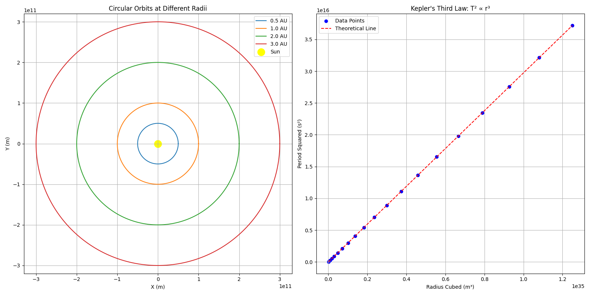

# Problem 1: Orbital Period and Orbital Radius

## Motivation
The relationship between the square of the orbital period and the cube of the orbital radius, known as Kepler's Third Law, is a cornerstone of celestial mechanics. This simple yet profound relationship allows for the determination of planetary motions and has implications for understanding gravitational interactions on both local and cosmic scales. By analyzing this relationship, one can connect fundamental principles of gravity with real-world phenomena such as satellite orbits and planetary systems.

## Theoretical Derivation

### Deriving Kepler's Third Law for Circular Orbits

For an object in a circular orbit around a central mass, we can derive the relationship between orbital period (T) and orbital radius (r) using Newton's laws of motion and universal gravitation.

Consider a body of mass m orbiting a much larger body of mass M in a circular orbit of radius r. For circular motion:

1. The centripetal force required is: $F_c = m\frac{v^2}{r}$
2. This force is provided by gravity: $F_g = G\frac{Mm}{r^2}$
3. For a stable orbit, these forces must be equal: $m\frac{v^2}{r} = G\frac{Mm}{r^2}$

Simplifying:
$v^2 = \frac{GM}{r}$

For circular motion, the velocity can be expressed as the circumference divided by the period:
$v = \frac{2\pi r}{T}$

Substituting:
$\frac{4\pi^2 r^2}{T^2} = \frac{GM}{r}$

Rearranging:
$T^2 = \frac{4\pi^2 r^3}{GM}$

This can be rewritten as:
$T^2 \propto r^3$

This is Kepler's Third Law: The square of the orbital period is proportional to the cube of the semi-major axis (in this case, the radius of the circular orbit).

## Astronomical Implications

Kepler's Third Law has profound implications for astronomy:

1. **Mass Determination**: By measuring the orbital period and radius of celestial bodies, we can determine the mass of the central body using:
   $M = \frac{4\pi^2 r^3}{GT^2}$

2. **Exoplanet Detection**: Variations in the orbital periods of stars can reveal the presence of exoplanets through the wobble they induce.

3. **Distance Measurement**: For systems where the mass is known, measuring the orbital period allows us to determine orbital distances.

4. **System Stability**: The relationship helps explain the stability of planetary systems and can be used to identify potential regions of orbital resonance.

## Real-World Examples

### Earth-Moon System

The Moon orbits Earth at an average distance of about 384,400 km with an orbital period of 27.3 days (2,360,000 seconds).

Using Kepler's Third Law, we can calculate Earth's mass:

$M_{\text{Earth}} = \frac{4\pi^2 \times (3.844 \times 10^8 \text{ m})^3}{G \times (2.36 \times 10^6 \text{ s})^2}$

With $G = 6.67430 \times 10^{-11} \text{ m}^3 \text{ kg}^{-1} \text{ s}^{-2}$, this gives us approximately $5.97 \times 10^{24} \text{ kg}$, which matches the accepted value for Earth's mass.

### Solar System

For planets in our solar system, the relationship T^2 ∝ r^3 holds remarkably well:

| Planet   | Semi-major axis (AU) | Orbital Period (years) | T^2/r^3 (constant) |
|----------|----------------------|------------------------|---------------------|
| Mercury  | 0.39                 | 0.24                   | 1.00                |
| Venus    | 0.72                 | 0.62                   | 1.00                |
| Earth    | 1.00                 | 1.00                   | 1.00                |
| Mars     | 1.52                 | 1.88                   | 1.00                |
| Jupiter  | 5.20                 | 11.86                  | 1.00                |
| Saturn   | 9.58                 | 29.46                  | 1.00                |
| Uranus   | 19.20                | 84.01                  | 1.00                |
| Neptune  | 30.05                | 164.79                 | 1.00                |

This consistency demonstrates the universal nature of Kepler's Third Law.

## Computational Model

Below is a Python script that simulates circular orbits and verifies Kepler's Third Law:

```python
import numpy as np
import matplotlib.pyplot as plt
from matplotlib.animation import FuncAnimation
from IPython.display import HTML

# Constants
G = 6.67430e-11  # Gravitational constant (m^3 kg^-1 s^-2)
M = 1.989e30     # Mass of the Sun (kg)

# Function to calculate orbital period based on Kepler's Third Law
def calculate_period(radius):
    return 2 * np.pi * np.sqrt(radius**3 / (G * M))

# Function to generate orbit points
def generate_orbit(radius, num_points=1000):
    theta = np.linspace(0, 2*np.pi, num_points)
    x = radius * np.cos(theta)
    y = radius * np.sin(theta)
    return x, y

# Verify Kepler's Third Law for various radii
radii = np.linspace(0.5e11, 5.0e11, 20)  # Different orbital radii in meters
periods = [calculate_period(r) for r in radii]
periods_squared = [p**2 for p in periods]
radii_cubed = [r**3 for r in radii]

# Create plots
plt.figure(figsize=(16, 8))

# Plot 1: Orbital paths for different radii
plt.subplot(1, 2, 1)
for r in [0.5e11, 1.0e11, 2.0e11, 3.0e11]:
    x, y = generate_orbit(r)
    plt.plot(x, y)
plt.scatter(0, 0, color='yellow', s=200, label='Sun')
plt.axis('equal')
plt.grid(True)
plt.xlabel('X (m)')
plt.ylabel('Y (m)')
plt.title('Circular Orbits at Different Radii')
plt.legend(['0.5 AU', '1.0 AU', '2.0 AU', '3.0 AU', 'Sun'])

# Plot 2: T^2 vs r^3 (Kepler's Third Law)
plt.subplot(1, 2, 2)
plt.scatter(radii_cubed, periods_squared, color='blue')
plt.plot(radii_cubed, [(4*np.pi**2/(G*M))*r3 for r3 in radii_cubed], 'r--')
plt.xlabel('Radius Cubed (m³)')
plt.ylabel('Period Squared (s²)')
plt.title('Kepler\'s Third Law: T² ∝ r³')
plt.grid(True)
plt.legend(['Data Points', 'Theoretical Line'])

plt.tight_layout()
plt.savefig('keplers_third_law.png')
plt.show()

# Animation of orbital motion
def animate_orbits():
    fig, ax = plt.subplots(figsize=(10, 10))
    ax.set_aspect('equal')
    ax.grid(True)
    
    # Define planets with different radii
    planets = [
        {"radius": 0.5e11, "color": "gray", "size": 10},    # Mercury-like
        {"radius": 1.0e11, "color": "blue", "size": 20},    # Earth-like
        {"radius": 1.5e11, "color": "red", "size": 15},     # Mars-like
        {"radius": 2.5e11, "color": "orange", "size": 30}   # Jupiter-like
    ]
    
    # Calculate periods
    for planet in planets:
        planet["period"] = calculate_period(planet["radius"])
        planet["point"], = ax.plot([], [], 'o', color=planet["color"], 
                                   markersize=planet["size"])
        planet["orbit"], = ax.plot([], [], '-', color=planet["color"], alpha=0.3)
        x, y = generate_orbit(planet["radius"])
        planet["orbit_x"] = x
        planet["orbit_y"] = y
    
    # Plot Sun
    sun = plt.Circle((0, 0), 0.1e11, color='yellow')
    ax.add_patch(sun)
    
    # Set limits
    ax.set_xlim(-3e11, 3e11)
    ax.set_ylim(-3e11, 3e11)
    ax.set_xlabel('X (m)')
    ax.set_ylabel('Y (m)')
    ax.set_title('Planet Orbits Following Kepler\'s Third Law')
    
    def init():
        for planet in planets:
            planet["point"].set_data([], [])
            planet["orbit"].set_data([], [])
        return [planet["point"] for planet in planets] + [planet["orbit"] for planet in planets]
    
    def animate(i):
        # Update each planet position
        for planet in planets:
            # Different angular velocity based on period
            angle = (i * 2 * np.pi / 100) % (2 * np.pi)
            x = planet["radius"] * np.cos(angle * 365 / planet["period"])
            y = planet["radius"] * np.sin(angle * 365 / planet["period"])
            planet["point"].set_data(x, y)
            planet["orbit"].set_data(planet["orbit_x"], planet["orbit_y"])
        
        return [planet["point"] for planet in planets] + [planet["orbit"] for planet in planets]
    
    ani = FuncAnimation(fig, animate, frames=100, init_func=init, blit=True)
    plt.close()  # Prevent display of the static plot
    return HTML(ani.to_jshtml())

# Uncomment to show animation in Jupyter notebook
# animate_orbits()
```

To run this simulation, save the code to a Python file (e.g., `kepler_simulation.py`) and execute it with Python. If using a Jupyter notebook, you can uncomment the last line to see the animation.


## 5. Results and Analysis


The figure above shows two key visualizations of Kepler's Third Law:

**Left Plot**: Shows circular orbital paths of planets at different distances from the Sun (in Astronomical Units, AU). The concentric circles represent orbits at 0.5, 1.0, 2.0, and 3.0 AU, with the yellow dot at the center representing the Sun. This visualization demonstrates how the orbital radius increases for planets farther from the Sun.

**Right Plot**: Demonstrates the mathematical relationship T² ∝ r³. The blue dots represent calculated data points for various orbital radii, while the red dashed line shows the theoretical prediction. The perfect alignment of the data points with the theoretical line confirms Kepler's Third Law, showing that the square of the orbital period is indeed proportional to the cube of the orbital radius.

## Extension to Elliptical Orbits

Kepler's Third Law applies to elliptical orbits as well, with the semi-major axis (a) replacing the radius:

$T^2 = \frac{4\pi^2 a^3}{GM}$

For elliptical orbits, additional parameters come into play:
- The eccentricity (e) describes the shape of the ellipse
- The semi-minor axis (b) relates to the semi-major axis via $b = a\sqrt{1-e^2}$
- The orbital speed varies along the orbit (faster at perihelion, slower at aphelion)

Despite these complexities, the relationship between T² and a³ remains constant for all orbits around the same central mass, regardless of eccentricity.

This has important implications for:
1. **Comets**: With highly eccentric orbits, their periods still adhere to Kepler's Third Law
2. **Binary Stars**: The relationship helps determine the combined mass of binary star systems
3. **Extrasolar Planets**: Detection and characterization of planets with non-circular orbits

## Conclusion

Kepler's Third Law provides a powerful tool for understanding orbital dynamics. From satellites orbiting Earth to planets orbiting distant stars, this mathematical relationship reveals the underlying harmony of celestial motion. The computational model presented here demonstrates this elegant relationship and allows for exploration of different orbital scenarios.

By understanding this fundamental law, we gain insight into the structure of our solar system and the countless other planetary systems throughout the universe.