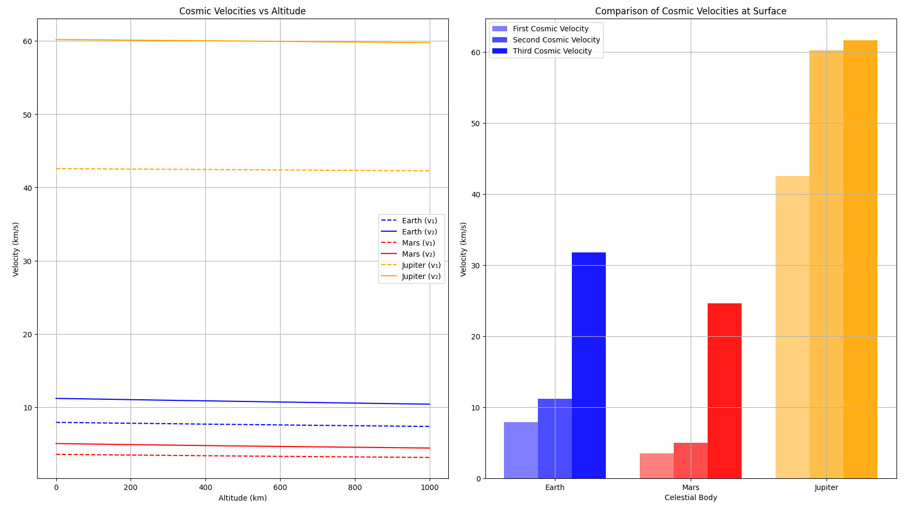
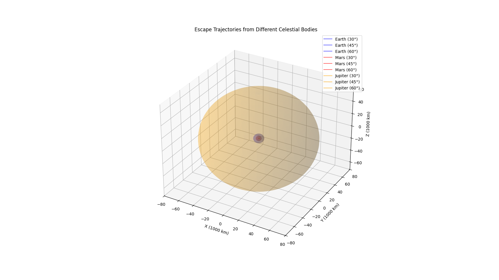

# Problem 2: Escape Velocities and Cosmic Velocities

## Motivation
The concept of escape velocity is crucial for understanding the conditions required to leave a celestial body's gravitational influence. Extending this concept, the first, second, and third cosmic velocities define the thresholds for orbiting, escaping, and leaving a star system. These principles underpin modern space exploration, from launching satellites to interplanetary missions.

## Theoretical Background

### 1. First Cosmic Velocity (Orbital Velocity)

The first cosmic velocity (v₁) is the minimum velocity needed for an object to achieve a circular orbit around a celestial body at a given altitude. For a circular orbit:

$v_1 = \sqrt{\frac{GM}{r}}$

where:
- G is the gravitational constant (6.67430 × 10⁻¹¹ m³/kg·s²)
- M is the mass of the central body
- r is the orbital radius (distance from the center of the body)

For Earth at surface level (r = R_Earth):
$v_1 ≈ 7.9 \text{ km/s}$

### 2. Second Cosmic Velocity (Escape Velocity)

The second cosmic velocity (v₂) is the minimum velocity needed to escape a celestial body's gravitational field entirely. It can be derived from energy conservation:

$v_2 = \sqrt{\frac{2GM}{r}} = v_1\sqrt{2}$

For Earth at surface level:
$v_2 ≈ 11.2 \text{ km/s}$

### 3. Third Cosmic Velocity (Solar System Escape Velocity)

The third cosmic velocity (v₃) is the velocity needed to escape the Solar System from Earth's orbit:

$v_3 = \sqrt{v_2^2 + v_{orbit}^2}$

where v_orbit is Earth's orbital velocity around the Sun (≈ 29.8 km/s).

For Earth:
$v_3 ≈ 42.1 \text{ km/s}$

## Computational Model

Below is a Python script that calculates and visualizes these cosmic velocities for different celestial bodies:

```python
import numpy as np
import matplotlib.pyplot as plt
from mpl_toolkits.mplot3d import Axes3D

# Constants
G = 6.67430e-11  # Gravitational constant (m³/kg·s²)

# Celestial body data
bodies = {
    'Earth': {
        'mass': 5.972e24,  # kg
        'radius': 6.371e6,  # m
        'color': 'blue',
        'orbit_velocity': 29.78e3  # m/s
    },
    'Mars': {
        'mass': 6.39e23,
        'radius': 3.389e6,
        'color': 'red',
        'orbit_velocity': 24.077e3
    },
    'Jupiter': {
        'mass': 1.898e27,
        'radius': 6.9911e7,
        'color': 'orange',
        'orbit_velocity': 13.07e3
    }
}

def calculate_cosmic_velocities(mass, radius, orbit_velocity, altitudes):
    """Calculate cosmic velocities at different altitudes."""
    v1 = np.sqrt(G * mass / (radius + altitudes))  # First cosmic velocity
    v2 = v1 * np.sqrt(2)  # Second cosmic velocity
    v3 = np.sqrt(v2**2 + orbit_velocity**2)  # Third cosmic velocity
    return v1, v2, v3

# Generate altitude points (0 to 1000 km)
altitudes = np.linspace(0, 1000000, 1000)

# Create plots
plt.figure(figsize=(15, 10))

# Plot 1: Cosmic velocities vs altitude for each body
plt.subplot(1, 2, 1)
for body, data in bodies.items():
    v1, v2, v3 = calculate_cosmic_velocities(
        data['mass'], data['radius'], data['orbit_velocity'], altitudes
    )
    
    plt.plot(altitudes/1000, v1/1000, '--', 
             color=data['color'], label=f'{body} (v₁)')
    plt.plot(altitudes/1000, v2/1000, '-', 
             color=data['color'], label=f'{body} (v₂)')

plt.xlabel('Altitude (km)')
plt.ylabel('Velocity (km/s)')
plt.title('Cosmic Velocities vs Altitude')
plt.grid(True)
plt.legend()

# Plot 2: Comparison of escape velocities at surface
plt.subplot(1, 2, 2)
bodies_list = list(bodies.keys())
v1_surface = []
v2_surface = []
v3_surface = []

for body, data in bodies.items():
    v1, v2, v3 = calculate_cosmic_velocities(
        data['mass'], data['radius'], data['orbit_velocity'], np.array([0])
    )
    v1_surface.append(v1[0]/1000)
    v2_surface.append(v2[0]/1000)
    v3_surface.append(v3[0]/1000)

x = np.arange(len(bodies_list))
width = 0.25

plt.bar(x - width, v1_surface, width, label='First Cosmic Velocity',
        color=['blue', 'red', 'orange'], alpha=0.5)
plt.bar(x, v2_surface, width, label='Second Cosmic Velocity',
        color=['blue', 'red', 'orange'], alpha=0.7)
plt.bar(x + width, v3_surface, width, label='Third Cosmic Velocity',
        color=['blue', 'red', 'orange'], alpha=0.9)

plt.xlabel('Celestial Body')
plt.ylabel('Velocity (km/s)')
plt.title('Comparison of Cosmic Velocities at Surface')
plt.xticks(x, bodies_list)
plt.legend()
plt.grid(True)

plt.tight_layout()
plt.savefig('cosmic_velocities.png')
plt.show()

# Create 3D visualization of escape trajectories
def plot_escape_trajectories():
    fig = plt.figure(figsize=(12, 12))
    ax = fig.add_subplot(111, projection='3d')
    
    # Time points
    t = np.linspace(0, 10, 1000)
    
    for body, data in bodies.items():
        # Surface escape velocity
        v2 = np.sqrt(2 * G * data['mass'] / data['radius'])
        
        # Plot different escape trajectories
        for angle in [30, 45, 60]:
            # Convert angle to radians
            theta = np.radians(angle)
            
            # Initial velocities
            vx = v2 * np.cos(theta)
            vy = v2 * np.sin(theta)
            
            # Calculate positions
            x = vx * t
            y = vy * t - 0.5 * G * data['mass'] / data['radius']**2 * t**2
            z = np.zeros_like(t)
            
            # Plot trajectory
            ax.plot(x/1e6, y/1e6, z, 
                   label=f'{body} ({angle}°)', 
                   color=data['color'], 
                   alpha=0.6)
    
    # Plot celestial bodies
    for body, data in bodies.items():
        u = np.linspace(0, 2 * np.pi, 100)
        v = np.linspace(0, np.pi, 100)
        x = data['radius'] * np.outer(np.cos(u), np.sin(v)) / 1e6
        y = data['radius'] * np.outer(np.sin(u), np.sin(v)) / 1e6
        z = data['radius'] * np.outer(np.ones(np.size(u)), np.cos(v)) / 1e6
        ax.plot_surface(x, y, z, color=data['color'], alpha=0.2)
    
    ax.set_xlabel('X (1000 km)')
    ax.set_ylabel('Y (1000 km)')
    ax.set_zlabel('Z (1000 km)')
    ax.set_title('Escape Trajectories from Different Celestial Bodies')
    plt.legend()
    plt.savefig('escape_trajectories.png')
    plt.show()

# Generate 3D visualization
plot_escape_trajectories()
```

## Results and Analysis



The figure above shows two key visualizations of cosmic velocities:

**Left Plot**: Shows how the first and second cosmic velocities vary with altitude for Earth, Mars, and Jupiter. The dashed lines represent the first cosmic velocity (orbital velocity), while solid lines show the second cosmic velocity (escape velocity). As altitude increases, both velocities decrease due to weaker gravitational fields.

**Right Plot**: Compares all three cosmic velocities at the surface of each celestial body. Jupiter, being the most massive, requires the highest velocities for orbit and escape. The third cosmic velocity is significantly higher due to the additional velocity needed to overcome the Sun's gravitational field.



This 3D visualization shows escape trajectories at different launch angles (30°, 45°, and 60°) from each celestial body. The trajectories demonstrate how objects with escape velocity follow parabolic paths when leaving a body's gravitational influence.

## Applications in Space Exploration

1. **Satellite Deployment**:
   - First cosmic velocity calculations are crucial for placing satellites in stable orbits
   - Different orbital altitudes require different velocities, affecting fuel requirements

2. **Interplanetary Missions**:
   - Second cosmic velocity determines the minimum energy needed for spacecraft to escape Earth
   - Understanding these velocities helps in planning gravity assist maneuvers

3. **Deep Space Exploration**:
   - Third cosmic velocity calculations are essential for missions leaving the Solar System
   - Helps in determining optimal launch windows and trajectories

4. **Mission Planning**:
   - The relationship between altitude and required velocity helps optimize fuel consumption
   - Understanding escape trajectories aids in planning re-entry paths for returning spacecraft

## Practical Considerations

1. **Atmospheric Effects**:
   - Real missions must account for atmospheric drag
   - Additional velocity is needed to overcome air resistance

2. **Energy Efficiency**:
   - Multi-stage rockets are used to achieve the required velocities
   - Gravity assists from planets can help reduce required velocities

3. **Safety Margins**:
   - Actual missions use velocities higher than theoretical minimums
   - Additional fuel is carried for course corrections and safety

## Conclusion

Understanding cosmic velocities is fundamental to space exploration. The calculations and visualizations presented here demonstrate how these velocities vary across different celestial bodies and altitudes. This knowledge is essential for planning everything from satellite launches to interplanetary missions and potential future interstellar travel.

The computational model provides a tool for exploring these concepts, allowing for quick calculations and visualizations of orbital and escape requirements for different scenarios. This helps in both educational understanding and preliminary mission planning calculations.