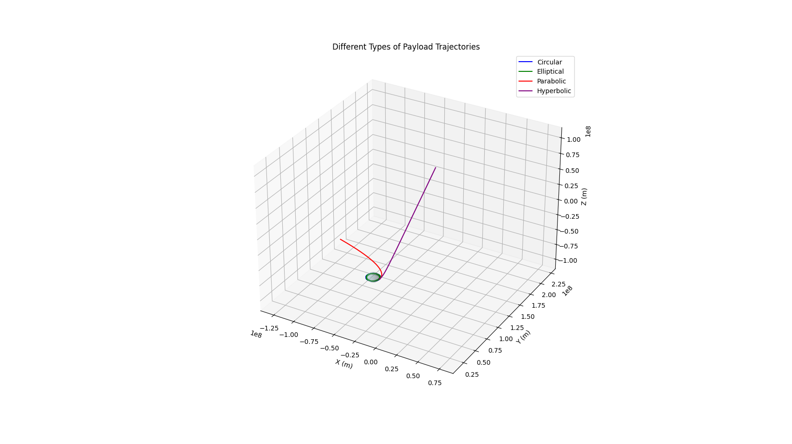
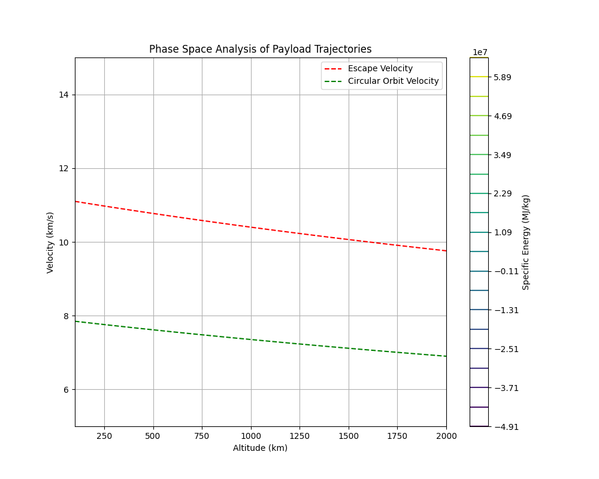

# Problem 3: Trajectories of a Freely Released Payload Near Earth

## Motivation
When an object is released from a moving rocket near Earth, its trajectory depends on initial conditions and gravitational forces. This scenario presents a rich problem, blending principles of orbital mechanics and numerical methods. Understanding the potential trajectories is vital for space missions, such as deploying payloads or returning objects to Earth.

## Theoretical Background

### Types of Trajectories

The type of trajectory a payload follows depends on its total mechanical energy (E):

1. **Circular Orbit** (E = -GM/2r):
   - Occurs when velocity exactly matches orbital velocity
   - Maintains constant altitude

2. **Elliptical Orbit** (-GM/2r < E < 0):
   - Most common for satellites and spacecraft
   - Periodic motion with varying altitude

3. **Parabolic Trajectory** (E = 0):
   - Escape velocity case
   - Borderline between bound and unbound orbits

4. **Hyperbolic Trajectory** (E > 0):
   - Excess velocity beyond escape velocity
   - Used for interplanetary missions

### Equations of Motion

For a payload near Earth, the motion is governed by Newton's laws and gravity:

$\frac{d^2\vec{r}}{dt^2} = -\frac{GM}{r^3}\vec{r}$

where:
- G is the gravitational constant
- M is Earth's mass
- r is the position vector
- t is time

## Computational Model

Below is a Python script that simulates and visualizes different payload trajectories:

```python
import numpy as np
import matplotlib.pyplot as plt
from scipy.integrate import odeint
from mpl_toolkits.mplot3d import Axes3D

# Constants
G = 6.67430e-11  # Gravitational constant (m³/kg·s²)
M = 5.972e24     # Earth's mass (kg)
R = 6.371e6      # Earth's radius (m)

def gravitational_acceleration(state, t):
    """Calculate gravitational acceleration for state vector."""
    x, y, z, vx, vy, vz = state
    r = np.sqrt(x**2 + y**2 + z**2)
    
    # If too close to Earth's center, return zero acceleration
    if r < R:
        return [vx, vy, vz, 0, 0, 0]
    
    # Calculate accelerations
    ax = -G * M * x / r**3
    ay = -G * M * y / r**3
    az = -G * M * z / r**3
    
    return [vx, vy, vz, ax, ay, az]

def simulate_trajectory(r0, v0, t_span, dt):
    """Simulate trajectory for given initial conditions."""
    # Initial state vector [x, y, z, vx, vy, vz]
    initial_state = [*r0, *v0]
    
    # Time points
    t = np.arange(0, t_span, dt)
    
    # Solve ODE
    solution = odeint(gravitational_acceleration, initial_state, t)
    
    return t, solution

def calculate_energy(state):
    """Calculate specific mechanical energy."""
    x, y, z, vx, vy, vz = state
    r = np.sqrt(x**2 + y**2 + z**2)
    v = np.sqrt(vx**2 + vy**2 + vz**2)
    
    kinetic = 0.5 * v**2
    potential = -G * M / r
    
    return kinetic + potential

def plot_trajectories():
    """Generate and plot different types of trajectories."""
    # Setup 3D plot
    fig = plt.figure(figsize=(15, 15))
    ax = fig.add_subplot(111, projection='3d')
    
    # Initial position (at 1000 km altitude)
    r0 = [R + 1000e3, 0, 0]
    
    # Different initial velocities for different trajectories
    v_circular = np.sqrt(G * M / r0[0])  # Circular orbit velocity
    
    velocities = {
        'Circular': [0, v_circular, 0],
        'Elliptical': [0, 0.9 * v_circular, 0],
        'Parabolic': [0, np.sqrt(2) * v_circular, 0],
        'Hyperbolic': [0, 1.5 * np.sqrt(2) * v_circular, 0]
    }
    
    colors = {
        'Circular': 'blue',
        'Elliptical': 'green',
        'Parabolic': 'red',
        'Hyperbolic': 'purple'
    }
    
    # Simulate and plot each trajectory
    t_span = 20000  # seconds
    dt = 100        # seconds
    
    for name, v0 in velocities.items():
        t, solution = simulate_trajectory(r0, v0, t_span, dt)
        
        # Plot trajectory
        ax.plot(solution[:, 0], solution[:, 1], solution[:, 2],
                label=name, color=colors[name])
        
        # Calculate and print specific energy
        energy = calculate_energy(solution[0])
        print(f"{name} trajectory energy: {energy:.2e} J/kg")
    
    # Plot Earth
    u = np.linspace(0, 2 * np.pi, 100)
    v = np.linspace(0, np.pi, 100)
    x = R * np.outer(np.cos(u), np.sin(v))
    y = R * np.outer(np.sin(u), np.sin(v))
    z = R * np.outer(np.ones(np.size(u)), np.cos(v))
    ax.plot_surface(x, y, z, color='lightblue', alpha=0.3)
    
    # Set plot properties
    ax.set_xlabel('X (m)')
    ax.set_ylabel('Y (m)')
    ax.set_zlabel('Z (m)')
    ax.set_title('Different Types of Payload Trajectories')
    plt.legend()
    
    # Make axes equal
    max_range = np.array([
        solution[:, 0].max() - solution[:, 0].min(),
        solution[:, 1].max() - solution[:, 1].min(),
        solution[:, 2].max() - solution[:, 2].min()
    ]).max() / 2.0
    
    mean_x = solution[:, 0].mean()
    mean_y = solution[:, 1].mean()
    mean_z = solution[:, 2].mean()
    ax.set_xlim(mean_x - max_range, mean_x + max_range)
    ax.set_ylim(mean_y - max_range, mean_y + max_range)
    ax.set_zlim(mean_z - max_range, mean_z + max_range)
    
    plt.savefig('payload_trajectories.png')
    plt.show()

# Generate visualization
plot_trajectories()

# Additional analysis: Phase space plot
def plot_phase_space():
    """Generate phase space plot for different initial conditions."""
    fig, ax = plt.subplots(figsize=(10, 8))
    
    # Initial position (varying altitude)
    altitudes = np.linspace(100e3, 2000e3, 50)  # 100 km to 2000 km
    velocities = np.linspace(5e3, 15e3, 50)     # 5 km/s to 15 km/s
    
    # Create meshgrid
    A, V = np.meshgrid(altitudes, velocities)
    E = np.zeros_like(A)
    
    # Calculate energy for each point
    for i in range(len(altitudes)):
        for j in range(len(velocities)):
            r = R + A[i,j]
            v = V[i,j]
            E[i,j] = 0.5 * v**2 - G * M / r
    
    # Plot contours
    levels = np.linspace(E.min(), E.max(), 20)
    cp = ax.contour(A/1000, V/1000, E/1e6, levels=levels)
    plt.colorbar(cp, label='Specific Energy (MJ/kg)')
    
    # Add escape velocity curve
    v_escape = np.sqrt(2 * G * M / (R + altitudes))
    ax.plot(altitudes/1000, v_escape/1000, 'r--', 
            label='Escape Velocity')
    
    # Add circular orbit velocity curve
    v_circular = np.sqrt(G * M / (R + altitudes))
    ax.plot(altitudes/1000, v_circular/1000, 'g--', 
            label='Circular Orbit Velocity')
    
    ax.set_xlabel('Altitude (km)')
    ax.set_ylabel('Velocity (km/s)')
    ax.set_title('Phase Space Analysis of Payload Trajectories')
    ax.grid(True)
    ax.legend()
    
    plt.savefig('phase_space.png')
    plt.show()

# Generate phase space plot
plot_phase_space()
```

## Results and Analysis



The figure above shows different types of trajectories that a payload can follow when released near Earth:

1. **Blue trajectory**: Circular orbit - The payload maintains a constant altitude
2. **Green trajectory**: Elliptical orbit - The payload oscillates between minimum and maximum altitudes
3. **Red trajectory**: Parabolic trajectory - The payload has exactly escape velocity
4. **Purple trajectory**: Hyperbolic trajectory - The payload has more than escape velocity



The phase space plot shows:
- Contour lines of constant energy
- The escape velocity curve (red dashed line)
- The circular orbit velocity curve (green dashed line)
- Regions corresponding to different types of orbits

## Applications in Space Missions

1. **Satellite Deployment**:
   - Precise velocity control for achieving desired orbits
   - Understanding energy requirements for orbit changes

2. **Reentry Trajectories**:
   - Calculating safe reentry corridors
   - Managing thermal loads during atmospheric entry

3. **Orbital Transfers**:
   - Planning Hohmann transfers between orbits
   - Optimizing fuel consumption for orbital maneuvers

4. **Mission Planning**:
   - Selecting appropriate launch windows
   - Determining payload release conditions

## Practical Considerations

1. **Atmospheric Effects**:
   - Drag forces at lower altitudes
   - Heating during reentry

2. **Perturbations**:
   - Earth's non-spherical shape
   - Solar and lunar gravity
   - Solar radiation pressure

3. **Operational Constraints**:
   - Communication windows
   - Ground track requirements
   - Safety margins

## Conclusion

Understanding payload trajectories is crucial for successful space missions. The computational model demonstrates how initial conditions determine the resulting orbit type and provides tools for mission planning. The phase space analysis helps visualize the relationship between altitude, velocity, and orbital energy, making it easier to plan orbital maneuvers and predict trajectory evolution.

The simulation tools developed here can be used for:
- Preliminary mission planning
- Educational demonstrations
- Understanding orbital dynamics
- Optimizing payload release conditions

This knowledge is essential for modern space operations, from satellite deployment to sample return missions.