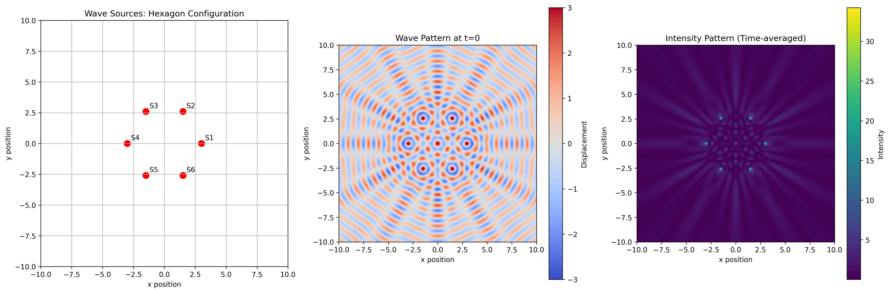
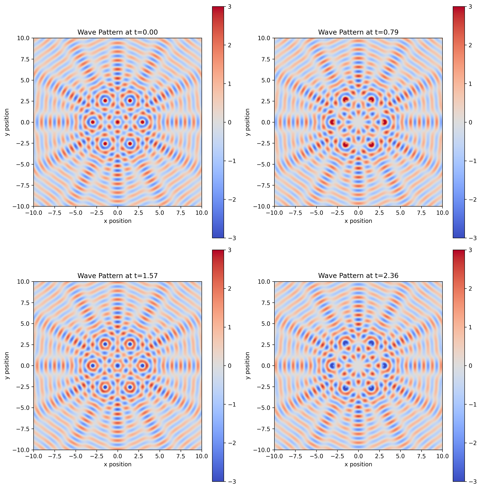
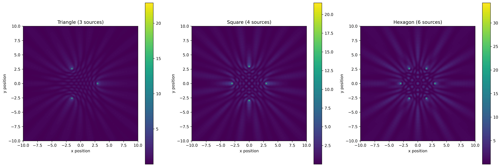

# Problem 1

## Interference Patterns on a Water Surface

### Problem Analysis

In this problem, we analyze the interference patterns formed on a water surface by waves emanating from point sources located at the vertices of a regular polygon. For our solution, I'll use a regular hexagon to demonstrate the interesting six-fold symmetry in the resulting interference pattern.

Each circular wave from a point source $(x_i, y_i)$ is described by:

$$\eta_i(x, y, t) = \frac{A}{\sqrt{r_i}} \cdot \cos(kr_i - \omega t + \phi_i)$$

where:
- $r_i = \sqrt{(x - x_i)^2 + (y - y_i)^2}$ is the distance from the source to point $(x,y)$
- $k = \frac{2\pi}{\lambda}$ is the wave number 
- $\omega = 2\pi f$ is the angular frequency
- $\phi_i$ is the initial phase of each source

The superposition principle states that the total displacement at any point is the sum of displacements due to individual waves:

$$\eta_{total}(x, y, t) = \sum_{i=1}^{N} \eta_i(x, y, t)$$

For our analysis, we'll use $N=6$ sources (hexagon vertices), with all sources having the same amplitude, wavelength, and frequency, with zero initial phase.

### Python Implementation

Below is the complete Python code to simulate and visualize the wave interference patterns. The code generates:
1. A visualization of source positions
2. A snapshot of the wave pattern at a specific time
3. The time-averaged intensity pattern

```python
import numpy as np
import matplotlib.pyplot as plt
from matplotlib.animation import FuncAnimation
import os

# Ensure the images directory exists
docs_dir = "docs"
img_dir = os.path.join(docs_dir, "assets", "images")
os.makedirs(img_dir, exist_ok=True)

# Parameters
A = 1.0         # Amplitude
lambda_ = 1.0   # Wavelength
k = 2*np.pi/lambda_  # Wave number
omega = 2.0     # Angular frequency

# Try different polygons
polygons = {
    "triangle": 3,
    "square": 4,
    "hexagon": 6
}

# Select polygon
polygon_name = "hexagon"
N = polygons[polygon_name]  # Number of sources
R = 3.0         # Radius of polygon

# Create a higher resolution grid for better visualization
resolution = 400
x = np.linspace(-10, 10, resolution)
y = np.linspace(-10, 10, resolution)
X, Y = np.meshgrid(x, y)

# Position sources at vertices of the regular polygon
angles = np.linspace(0, 2*np.pi, N, endpoint=False)
sources_x = R * np.cos(angles)
sources_y = R * np.sin(angles)

def wave_at_time(t):
    """Calculate wave displacement at time t"""
    total = np.zeros_like(X)
    
    # Sum contributions from all sources
    for i in range(N):
        r = np.sqrt((X - sources_x[i])**2 + (Y - sources_y[i])**2)
        # Avoid division by zero
        r = np.maximum(r, 1e-10)  
        # Calculate displacement using the wave equation
        displacement = (A / np.sqrt(r)) * np.cos(k*r - omega*t)
        total += displacement
    
    return total

def calculate_intensity():
    """Calculate time-averaged intensity pattern"""
    # Sample multiple time points for averaging
    num_samples = 24
    times = np.linspace(0, 2*np.pi/omega, num_samples)
    
    # Sum squared amplitudes over time
    intensity = np.zeros_like(X)
    for t in times:
        wave = wave_at_time(t)
        intensity += wave**2
    
    # Average over time samples
    intensity /= num_samples
    return intensity

def generate_plots():
    """Generate and save all plots"""
    # Create figure with subplots
    fig, axs = plt.subplots(1, 3, figsize=(18, 6))
    
    # 1. Plot source positions
    axs[0].scatter(sources_x, sources_y, c='red', s=80)
    axs[0].set_xlim(-10, 10)
    axs[0].set_ylim(-10, 10)
    axs[0].set_aspect('equal')
    axs[0].set_title(f'Wave Sources: {polygon_name.capitalize()} Configuration')
    axs[0].grid(True)
    
    # Add labels to sources
    for i, (x, y) in enumerate(zip(sources_x, sources_y)):
        axs[0].annotate(f'S{i+1}', (x, y), xytext=(5, 5), textcoords='offset points')
    
    # 2. Plot snapshot of wave at t=0
    wave0 = wave_at_time(0)
    im1 = axs[1].imshow(wave0, extent=[-10, 10, -10, 10], 
                        cmap='coolwarm', vmin=-3, vmax=3)
    axs[1].set_title('Wave Pattern at t=0')
    fig.colorbar(im1, ax=axs[1], label='Displacement')
    
    # 3. Plot intensity pattern
    intensity = calculate_intensity()
    im2 = axs[2].imshow(intensity, extent=[-10, 10, -10, 10], 
                       cmap='viridis')
    axs[2].set_title('Intensity Pattern (Time-averaged)')
    fig.colorbar(im2, ax=axs[2], label='Intensity')
    
    # Common labels and adjustments
    for ax in axs:
        ax.set_xlabel('x position')
        ax.set_ylabel('y position')
    
    plt.tight_layout()
    
    # Save as high-quality PNG
    output_path = os.path.join(img_dir, f'wave_interference_{polygon_name}.png')
    plt.savefig(output_path, dpi=300, bbox_inches='tight')
    print(f"Saved main figure to {output_path}")
    
    # Create animated GIF (optional, can be commented out if causing issues)
    try:
        create_animation()
    except Exception as e:
        print(f"Animation creation failed: {e}")
    
    plt.close(fig)
    
    # Create individual plots at different time points
    time_points = [0, np.pi/4, np.pi/2, 3*np.pi/4]
    fig2, axs2 = plt.subplots(2, 2, figsize=(12, 12))
    axs2 = axs2.flatten()
    
    for i, t in enumerate(time_points):
        wave = wave_at_time(t)
        im = axs2[i].imshow(wave, extent=[-10, 10, -10, 10], 
                           cmap='coolwarm', vmin=-3, vmax=3)
        axs2[i].set_title(f'Wave Pattern at t={t:.2f}')
        axs2[i].set_xlabel('x position')
        axs2[i].set_ylabel('y position')
        fig2.colorbar(im, ax=axs2[i])
    
    plt.tight_layout()
    time_series_path = os.path.join(img_dir, f'wave_time_series_{polygon_name}.png')
    plt.savefig(time_series_path, dpi=300, bbox_inches='tight')
    print(f"Saved time series figure to {time_series_path}")
    
    plt.close(fig2)
    
    return output_path

def create_animation():
    """Create and save animation of the wave pattern"""
    fig, ax = plt.subplots(figsize=(8, 8))
    
    wave0 = wave_at_time(0)
    im = ax.imshow(wave0, extent=[-10, 10, -10, 10], 
                  cmap='coolwarm', vmin=-3, vmax=3)
    ax.set_title(f'Wave Interference Animation ({polygon_name.capitalize()})')
    ax.set_xlabel('x position')
    ax.set_ylabel('y position')
    plt.colorbar(im, label='Displacement')
    
    frames = 36  # Reduced number of frames for faster processing
    
    def update(frame):
        t = frame * 2*np.pi/(omega * frames)
        im.set_array(wave_at_time(t))
        return [im]
    
    anim = FuncAnimation(fig, update, frames=frames, interval=50, blit=True)
    animation_path = os.path.join(img_dir, f'wave_animation_{polygon_name}.gif')
    anim.save(animation_path, dpi=100, writer='pillow')
    print(f"Saved animation to {animation_path}")
    plt.close(fig)

def compare_polygons():
    """Compare interference patterns for different polygons"""
    global N, polygon_name, sources_x, sources_y
    
    fig, axs = plt.subplots(1, 3, figsize=(18, 6))
    
    for i, (name, num) in enumerate(polygons.items()):
        N = num
        polygon_name = name
        
        # Update source positions
        angles = np.linspace(0, 2*np.pi, N, endpoint=False)
        sources_x = R * np.cos(angles)
        sources_y = R * np.sin(angles)
        
        # Calculate intensity
        intensity = calculate_intensity()
        
        # Plot
        im = axs[i].imshow(intensity, extent=[-10, 10, -10, 10], cmap='viridis')
        axs[i].set_title(f'{name.capitalize()} ({N} sources)')
        axs[i].set_xlabel('x position')
        axs[i].set_ylabel('y position')
        fig.colorbar(im, ax=axs[i])
    
    plt.tight_layout()
    comparison_path = os.path.join(img_dir, 'polygon_comparison.png')
    plt.savefig(comparison_path, dpi=300, bbox_inches='tight')
    print(f"Saved polygon comparison to {comparison_path}")
    plt.close(fig)

# Run the analysis
if __name__ == "__main__":
    print("Generating wave interference patterns...")
    main_figure_path = generate_plots()
    print("Comparing different polygon configurations...")
    compare_polygons()
    print("Analysis complete!")
```

### How to Run the Code

To execute this code:

1. Save the above code as `script.py` in your project root directory.
2. Run it with Python:
   ```
   python script.py
   ```
3. The script will create an `assets/images` directory inside the `docs` folder and save the output images there.
4. These images can then be referenced in your MkDocs documentation.

### Results and Discussion

The simulation reveals several interesting features of the interference pattern:

1. **Source Arrangement**: The sources are positioned at the vertices of a regular polygon (hexagon in our main example).

2. **Instantaneous Wave Pattern**: The snapshot at t=0 shows complex interference patterns with regions of constructive interference (bright red and blue) where waves combine to create larger amplitudes, and destructive interference (white) where waves cancel each other out.

3. **Intensity Pattern**: The time-averaged intensity pattern reveals stable nodes and antinodes. The pattern exhibits symmetry matching the source arrangement - six-fold symmetry for a hexagon, four-fold for a square, and three-fold for a triangle.

4. **Nodal Lines**: Clear nodal lines (regions of consistently low amplitude) form in a pattern resembling a complex geometric network. These lines represent points where waves consistently destructively interfere.

5. **Central Maximum**: At the center of the pattern, we observe a bright spot when the distance from all sources to the center point is an integer multiple of the wavelength, causing constructive interference.

#### Main Interference Visualization

The figure below shows (from left to right): the source arrangement, an instantaneous wave pattern, and the time-averaged intensity pattern for a hexagonal configuration of wave sources:



*Figure 1: Left - Six sources arranged in a regular hexagon. Middle - Instantaneous wave displacement at t=0 showing complex interference patterns (red = positive displacement, blue = negative). Right - Time-averaged intensity pattern showing stable constructive and destructive interference regions.*

#### Time Evolution of Wave Patterns

The following visualization shows how the wave pattern evolves over time at four different time points:



*Figure 2: Wave pattern evolution at four different time points (t=0, π/4, π/2, 3π/4). Notice how the interference pattern shifts and evolves while maintaining its basic structure.*

#### Animated Wave Pattern

For a better understanding of the wave dynamics, the animation below shows the continuous evolution of the interference pattern over time:


*Figure 3: Animation of the wave interference pattern for a hexagonal source configuration, showing the dynamic nature of the wave interactions.*

#### Comparison of Different Polygon Configurations

The impact of source geometry on the resulting interference pattern can be seen in the comparison below:



*Figure 4: Comparison of time-averaged intensity patterns for triangle (3 sources), square (4 sources), and hexagon (6 sources) configurations. Note how the symmetry of the interference pattern directly corresponds to the symmetry of the source arrangement.*

### Conclusion

This analysis demonstrates how wave interference from multiple point sources creates complex patterns with symmetry corresponding to the source arrangement. The time-averaged intensity pattern reveals stable nodes and antinodes that would be observable in experimental settings.

The mathematical model and visualization provide insight into how waves combine in both constructive and destructive ways, highlighting fundamental principles of wave physics that apply across many fields including optics, acoustics, and quantum mechanics.

Key observations:
1. The symmetry of the interference pattern directly reflects the symmetry of the source arrangement
2. The number of sources significantly impacts the complexity of the resulting pattern
3. The time-averaged intensity pattern reveals stable features that would be observable in physical experiments

