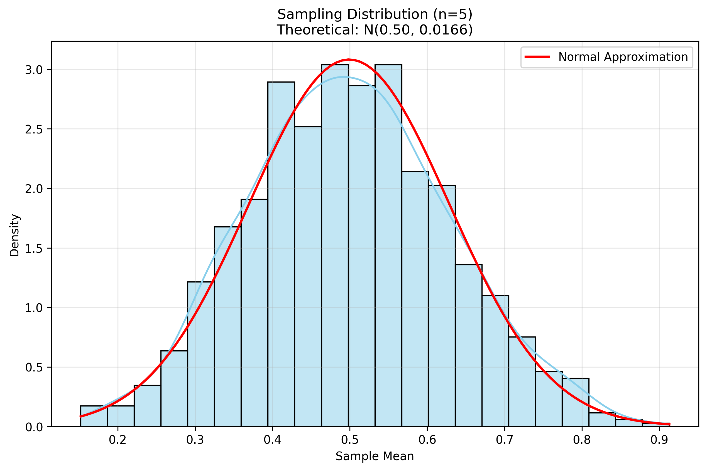
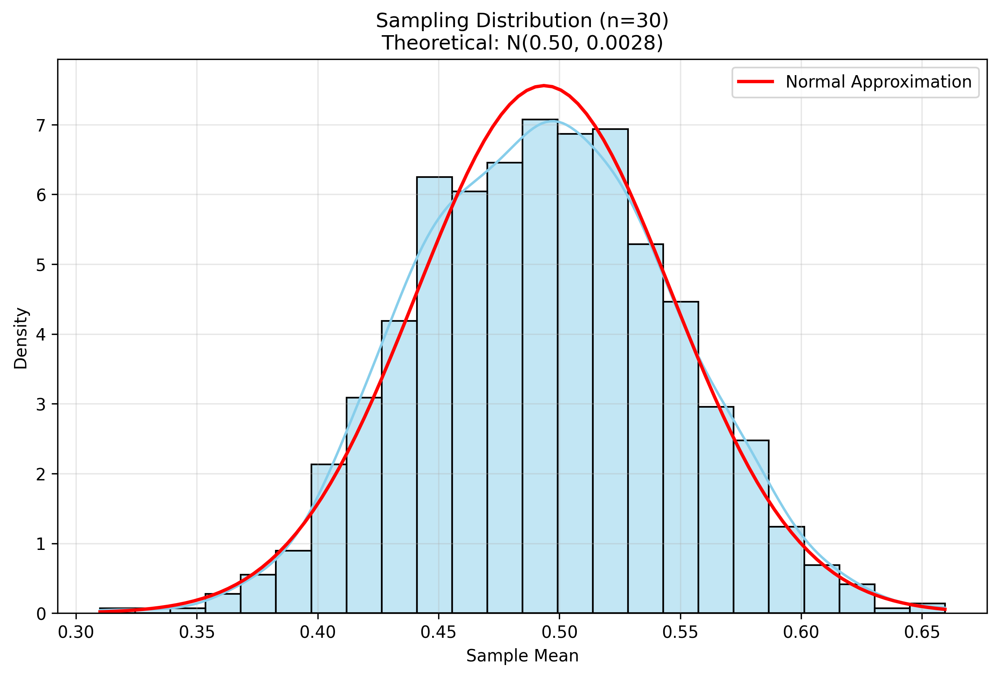
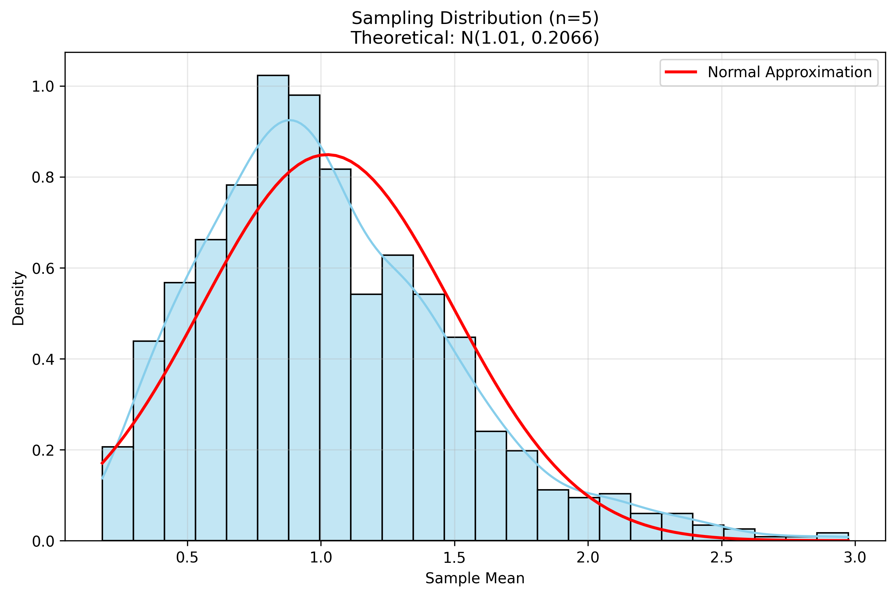
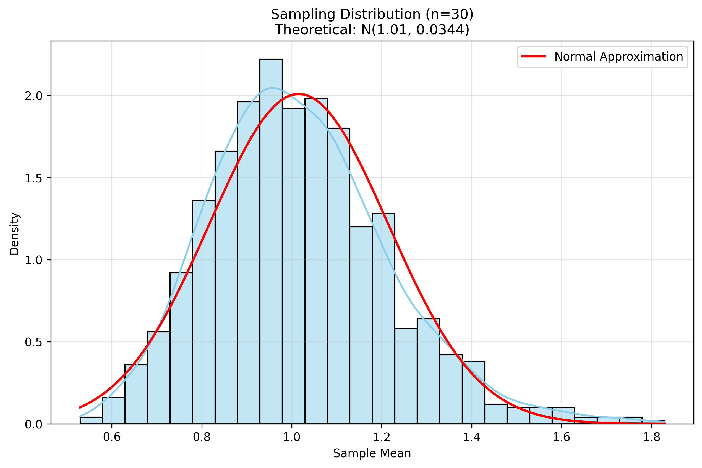
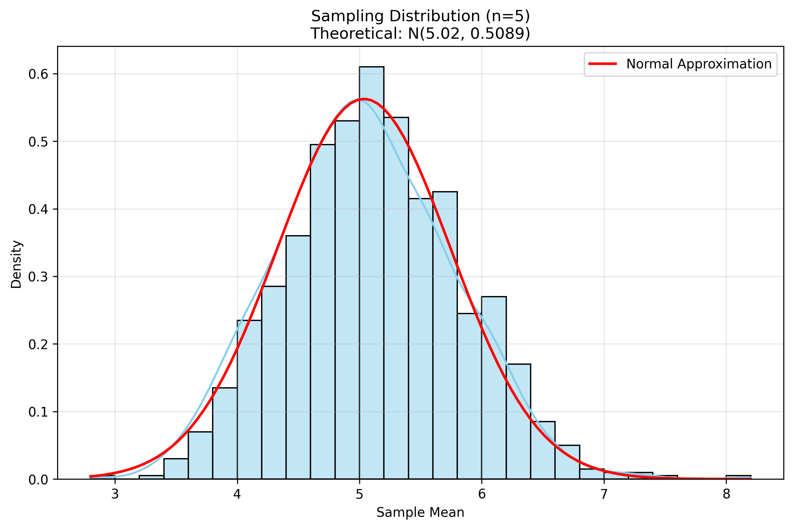
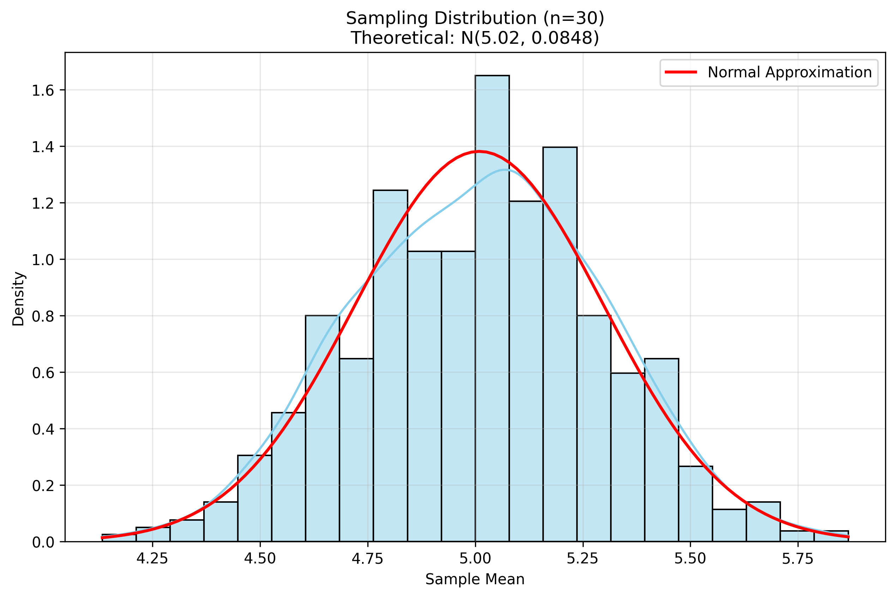

# Problem 1: Exploring the Central Limit Theorem through Simulations

## Introduction

The Central Limit Theorem (CLT) is one of the most fundamental concepts in statistics. It states that the sampling distribution of the sample mean approaches a normal distribution as the sample size increases, regardless of the population's original distribution. This theorem has profound implications for statistical inference and data analysis.

## Mathematical Foundation

The Central Limit Theorem can be formally stated as:

Let $X_1, X_2, \ldots, X_n$ be a random sample of size $n$ from a population with mean $\mu$ and variance $\sigma^2$. Then, as $n$ approaches infinity, the distribution of the sample mean $\bar{X} = \frac{1}{n}\sum_{i=1}^n X_i$ approaches a normal distribution with mean $\mu$ and variance $\frac{\sigma^2}{n}$:

$$\bar{X} \sim N\left(\mu, \frac{\sigma^2}{n}\right)$$

## Python Implementation

Let's implement a simulation to demonstrate the CLT using different population distributions:

```python
import numpy as np
import matplotlib.pyplot as plt
import seaborn as sns
from scipy import stats
import os

# Ensure the images directory exists
img_dir = os.path.join("docs", "1 Physics", "6 Statistics", "images")
os.makedirs(img_dir, exist_ok=True)

class CLTSimulator:
    """Simulator for demonstrating the Central Limit Theorem"""
    
    def __init__(self, population_size=10000, num_samples=1000):
        """
        Initialize the simulator.
        
        Parameters:
        - population_size: size of the population to generate
        - num_samples: number of samples to draw for each sample size
        """
        self.population_size = population_size
        self.num_samples = num_samples
        self.sample_sizes = [5, 10, 30, 50, 100]  # Different sample sizes to test
        
    def generate_population(self, dist_type, **params):
        """
        Generate a population from a specified distribution.
        
        Parameters:
        - dist_type: type of distribution ('uniform', 'exponential', 'binomial')
        - params: parameters for the distribution
        
        Returns:
        - population array
        """
        if dist_type == 'uniform':
            return np.random.uniform(params.get('low', 0), 
                                   params.get('high', 1), 
                                   self.population_size)
        elif dist_type == 'exponential':
            return np.random.exponential(params.get('scale', 1), 
                                       self.population_size)
        elif dist_type == 'binomial':
            return np.random.binomial(params.get('n', 10), 
                                    params.get('p', 0.5), 
                                    self.population_size)
        else:
            raise ValueError(f"Unknown distribution type: {dist_type}")
    
    def simulate_sampling_distribution(self, population, sample_size):
        """
        Simulate the sampling distribution of the mean for a given sample size.
        
        Parameters:
        - population: the population array
        - sample_size: size of each sample
        
        Returns:
        - array of sample means
        """
        sample_means = np.zeros(self.num_samples)
        for i in range(self.num_samples):
            sample = np.random.choice(population, size=sample_size, replace=True)
            sample_means[i] = np.mean(sample)
        return sample_means
    
    def plot_distribution(self, data, title, filename=None):
        """
        Plot a distribution with its theoretical normal approximation.
        
        Parameters:
        - data: array of sample means
        - title: plot title
        - filename: if provided, save to this filename
        """
        plt.figure(figsize=(10, 6))
        
        # Plot histogram
        sns.histplot(data, kde=True, stat='density', 
                    color='skyblue', edgecolor='black')
        
        # Plot normal approximation
        x = np.linspace(min(data), max(data), 100)
        mu, std = np.mean(data), np.std(data)
        y = stats.norm.pdf(x, mu, std)
        plt.plot(x, y, 'r-', linewidth=2, label='Normal Approximation')
        
        plt.title(title)
        plt.xlabel('Sample Mean')
        plt.ylabel('Density')
        plt.legend()
        plt.grid(True, alpha=0.3)
        
        if filename:
            save_path = os.path.join(img_dir, filename)
            plt.savefig(save_path, dpi=300, bbox_inches='tight')
            plt.close()
            return save_path
        
        return plt.gcf()
    
    def run_simulation(self, dist_type, **params):
        """
        Run a complete simulation for a given distribution.
        
        Parameters:
        - dist_type: type of distribution
        - params: parameters for the distribution
        
        Returns:
        - dictionary of results
        """
        print(f"\nRunning simulation for {dist_type} distribution")
        
        # Generate population
        population = self.generate_population(dist_type, **params)
        pop_mean = np.mean(population)
        pop_std = np.std(population)
        
        print(f"Population mean: {pop_mean:.4f}")
        print(f"Population standard deviation: {pop_std:.4f}")
        
        results = {
            'population': population,
            'sample_means': {},
            'plots': {}
        }
        
        # Simulate for each sample size
        for n in self.sample_sizes:
            print(f"  Sample size: {n}")
            sample_means = self.simulate_sampling_distribution(population, n)
            results['sample_means'][n] = sample_means
            
            # Calculate theoretical parameters
            theo_mean = pop_mean
            theo_std = pop_std / np.sqrt(n)
            
            # Plot results
            title = f"Sampling Distribution (n={n})\n" + \
                   f"Theoretical: N({theo_mean:.2f}, {theo_std**2:.4f})"
            filename = f"{dist_type}_n{n}.png"
            plot_path = self.plot_distribution(sample_means, title, filename)
            results['plots'][n] = plot_path
            
            # Print statistics
            print(f"    Sample mean: {np.mean(sample_means):.4f}")
            print(f"    Sample std: {np.std(sample_means):.4f}")
            print(f"    Theoretical std: {theo_std:.4f}")
        
        return results

def main():
    """Run simulations for different distributions"""
    simulator = CLTSimulator()
    
    # Run simulations for different distributions
    distributions = {
        'uniform': {'low': 0, 'high': 1},
        'exponential': {'scale': 1},
        'binomial': {'n': 10, 'p': 0.5}
    }
    
    results = {}
    for dist_type, params in distributions.items():
        results[dist_type] = simulator.run_simulation(dist_type, **params)
    
    return results

if __name__ == "__main__":
    main()
```

## Simulation Results and Analysis

### 1. Uniform Distribution

The uniform distribution is a simple case where all values in a range are equally likely. Let's examine how the sampling distribution of the mean converges to normality.



*Figure 1: Sampling distribution for uniform population with n=5*



*Figure 2: Sampling distribution for uniform population with n=30*

**Key Observations:**
- Even with a small sample size (n=5), the sampling distribution begins to show a bell-shaped curve
- As sample size increases, the distribution becomes more symmetric and approaches normality
- The standard deviation of the sampling distribution decreases as $\frac{\sigma}{\sqrt{n}}$
- The mean of the sampling distribution remains close to the population mean

### 2. Exponential Distribution

The exponential distribution is skewed and non-symmetric, making it an interesting test case for the CLT.



*Figure 3: Sampling distribution for exponential population with n=5*



*Figure 4: Sampling distribution for exponential population with n=30*

**Key Observations:**
- With small sample sizes, the sampling distribution retains some of the skewness of the original distribution
- As sample size increases, the distribution becomes more symmetric
- The convergence to normality is slower than for the uniform distribution
- The CLT still holds despite the original distribution's skewness

### 3. Binomial Distribution

The binomial distribution is discrete and can be skewed depending on the probability parameter.



*Figure 5: Sampling distribution for binomial population with n=5*



*Figure 6: Sampling distribution for binomial population with n=30*

**Key Observations:**
- The discrete nature of the original distribution is visible in small sample sizes
- As sample size increases, the distribution becomes more continuous
- The sampling distribution becomes more symmetric and normal
- The mean and variance follow the theoretical predictions

## Practical Implications

The Central Limit Theorem has numerous practical applications:

1. **Statistical Inference:**
   - Allows us to make inferences about population parameters using sample statistics
   - Forms the basis for confidence intervals and hypothesis testing
   - Enables the use of normal distribution tables for various statistical tests

2. **Quality Control:**
   - Used in manufacturing to monitor process quality
   - Helps determine if a process is operating within acceptable limits
   - Enables the detection of systematic changes in production

3. **Financial Modeling:**
   - Used in risk assessment and portfolio management
   - Helps model returns on investments
   - Forms the basis for many financial derivatives pricing models

4. **Survey Sampling:**
   - Allows for accurate estimation of population characteristics
   - Enables calculation of margin of error in polls
   - Helps determine appropriate sample sizes for desired precision

## Limitations and Considerations

While the CLT is powerful, it's important to understand its limitations:

1. **Sample Size Requirements:**
   - The required sample size for normality depends on the original distribution
   - More skewed distributions require larger samples
   - Rule of thumb: n ≥ 30 is often sufficient, but may need more for highly skewed distributions

2. **Outliers and Heavy Tails:**
   - The CLT may not apply well to distributions with extremely heavy tails
   - Outliers can significantly affect the convergence rate
   - In such cases, robust statistical methods may be more appropriate

3. **Dependence:**
   - The CLT assumes independent samples
   - Correlated data may require different approaches
   - Time series data often needs specialized techniques

## Conclusion

Through these simulations, we've demonstrated the power and universality of the Central Limit Theorem. Regardless of the original distribution's shape, the sampling distribution of the mean converges to a normal distribution as the sample size increases. This fundamental result underpins much of statistical inference and has wide-ranging applications in science, engineering, and business.

The simulations also highlight important practical considerations:
- The rate of convergence depends on the original distribution
- Sample size requirements vary based on the distribution's characteristics
- The CLT provides a powerful tool for statistical inference, but its assumptions must be carefully considered

Understanding the CLT and its implications is crucial for anyone working with data and statistical analysis. These simulations provide an intuitive way to grasp this important concept and its practical significance.

