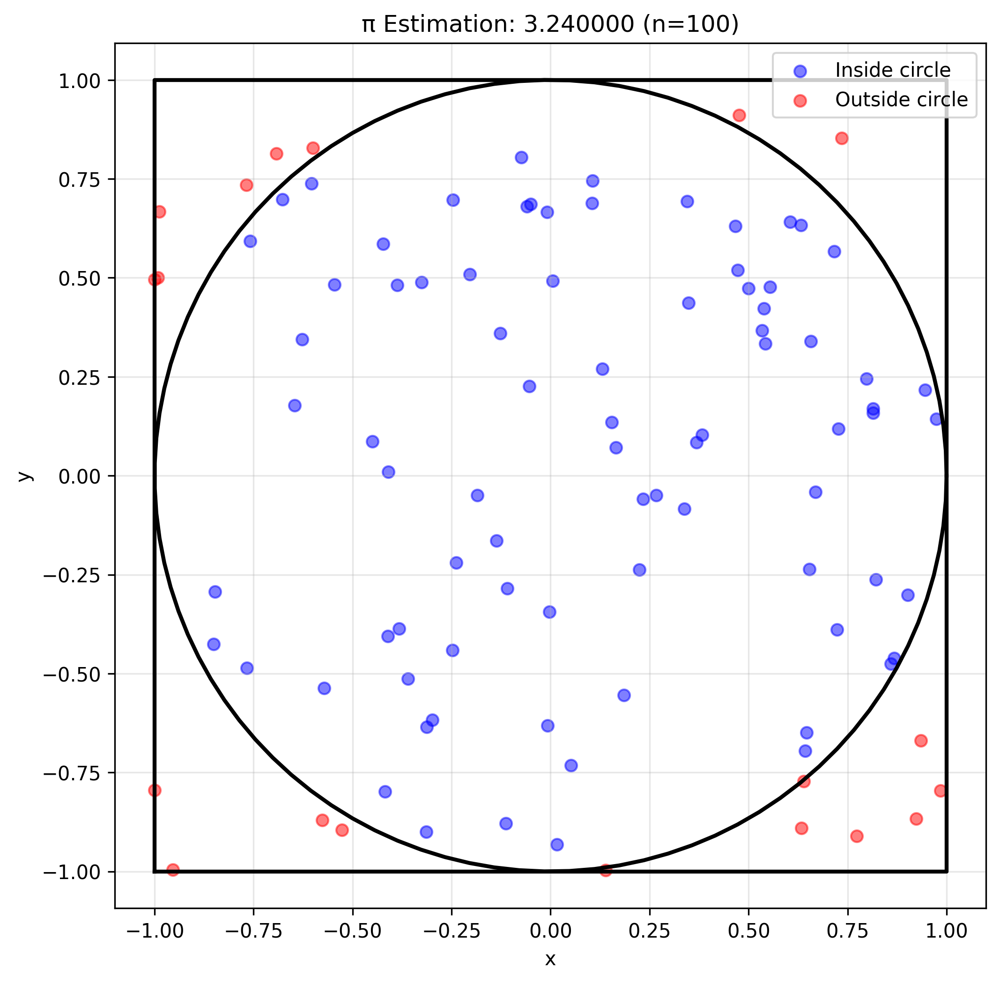
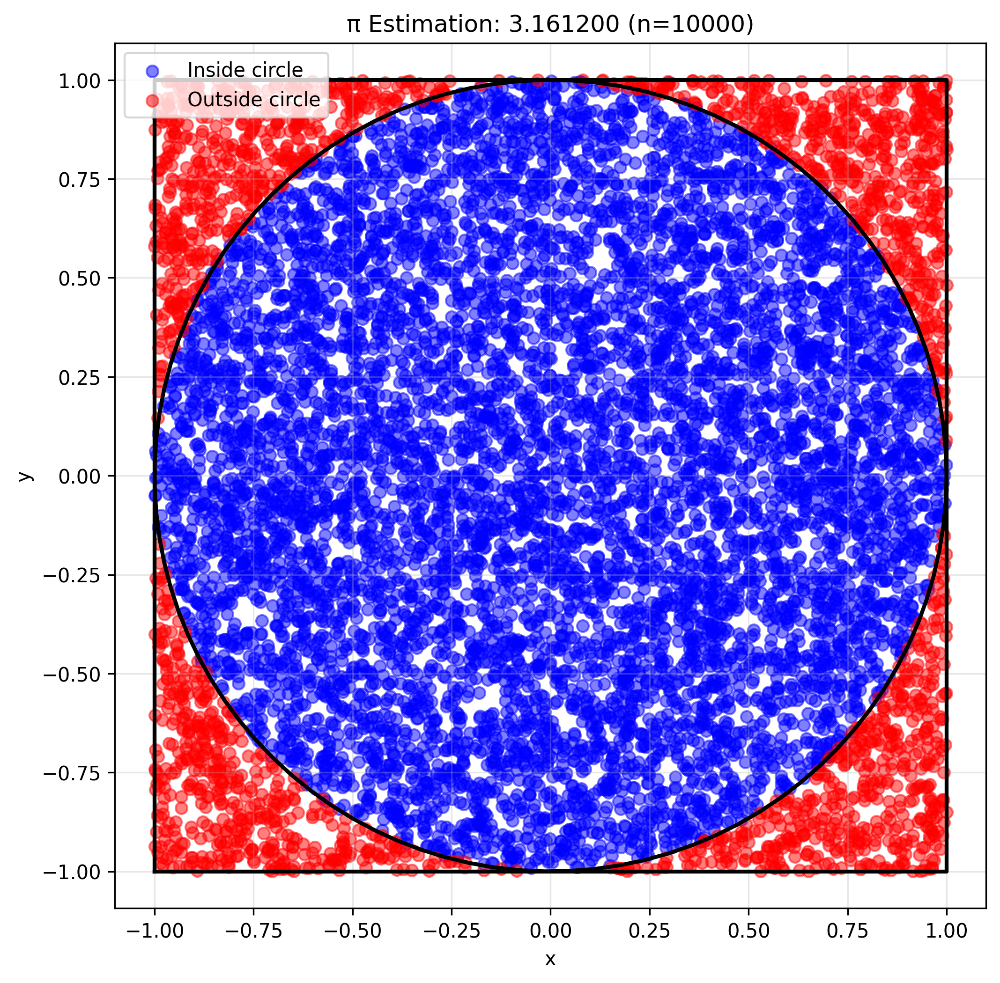
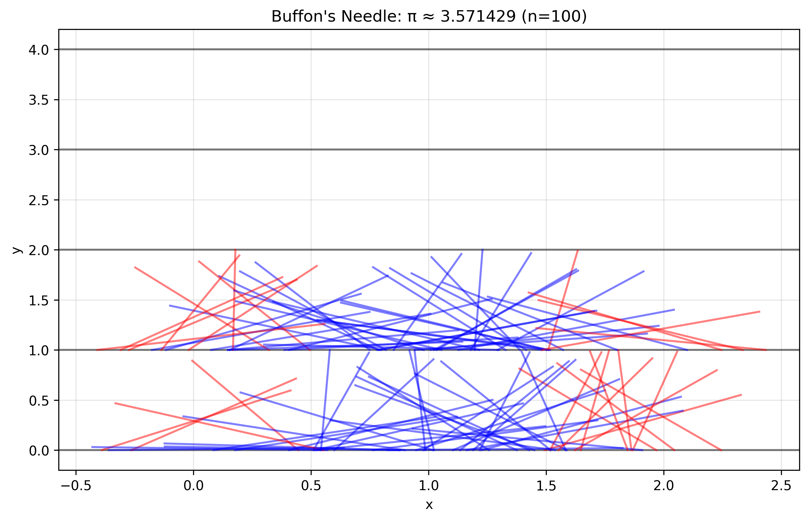
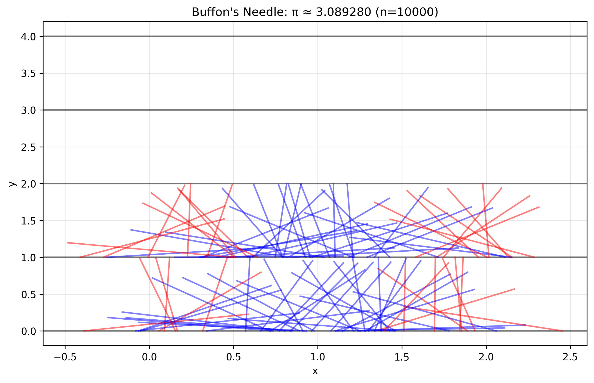
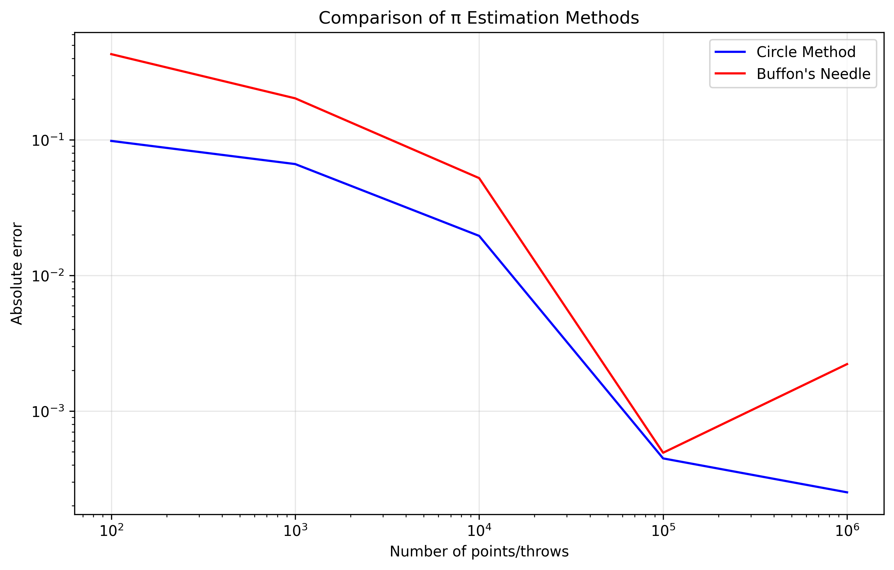

# Problem 2: Estimating π using Monte Carlo Methods

## Introduction

Monte Carlo methods are powerful computational techniques that use randomness to solve problems or estimate values. In this problem, we explore two different approaches to estimate the value of π using Monte Carlo simulations:
1. The circle method (geometric probability)
2. Buffon's Needle method

## Part 1: Estimating π Using a Circle

### Theoretical Foundation

The circle method is based on the ratio of areas between a unit circle and its bounding square. For a unit circle (radius = 1) inscribed in a square of side length 2:

- Area of the circle: $A_{circle} = \pi r^2 = \pi$
- Area of the square: $A_{square} = (2r)^2 = 4$

The ratio of these areas is: $\frac{A_{circle}}{A_{square}} = \frac{\pi}{4}$

Therefore, if we randomly generate points in the square, the probability that a point falls inside the circle is $\pi/4$. This leads to the estimation formula: $\pi \approx 4 \cdot \frac{\text{points inside circle}}{\text{total points}}$

### Python Implementation

```python
import numpy as np
import matplotlib.pyplot as plt
import os
from tqdm import tqdm

# Ensure the images directory exists
img_dir = os.path.join("docs", "1 Physics", "6 Statistics", "images")
os.makedirs(img_dir, exist_ok=True)

class CirclePiEstimator:
    """Estimator for π using the circle method"""
    
    def __init__(self, num_points=10000):
        """
        Initialize the estimator.
        
        Parameters:
        - num_points: number of random points to generate
        """
        self.num_points = num_points
        self.points = np.random.uniform(-1, 1, (num_points, 2))
        self.inside = np.sum(self.points[:, 0]**2 + self.points[:, 1]**2 <= 1)
        self.pi_estimate = 4 * self.inside / num_points
    
    def plot_points(self, filename=None):
        """Plot the random points and circle"""
        plt.figure(figsize=(8, 8))
        
        # Plot points
        inside = self.points[:, 0]**2 + self.points[:, 1]**2 <= 1
        plt.scatter(self.points[inside, 0], self.points[inside, 1], 
                   c='blue', alpha=0.5, label='Inside circle')
        plt.scatter(self.points[~inside, 0], self.points[~inside, 1], 
                   c='red', alpha=0.5, label='Outside circle')
        
        # Plot circle
        theta = np.linspace(0, 2*np.pi, 100)
        plt.plot(np.cos(theta), np.sin(theta), 'k-', linewidth=2)
        
        # Plot square
        plt.plot([-1, 1, 1, -1, -1], [-1, -1, 1, 1, -1], 'k-', linewidth=2)
        
        plt.title(f'π Estimation: {self.pi_estimate:.6f} (n={self.num_points})')
        plt.xlabel('x')
        plt.ylabel('y')
        plt.axis('equal')
        plt.legend()
        plt.grid(True, alpha=0.3)
        
        if filename:
            save_path = os.path.join(img_dir, filename)
            plt.savefig(save_path, dpi=300, bbox_inches='tight')
            plt.close()
            return save_path
        
        return plt.gcf()

def run_circle_simulation(num_points_list):
    """Run simulation for different numbers of points"""
    results = []
    for n in tqdm(num_points_list, desc="Running circle simulation"):
        estimator = CirclePiEstimator(n)
        results.append({
            'n': n,
            'pi_estimate': estimator.pi_estimate,
            'error': abs(estimator.pi_estimate - np.pi)
        })
        if n in [100, 1000, 10000, 100000]:
            estimator.plot_points(f'circle_pi_n{n}.png')
    return results
```

### Results and Analysis



*Figure 1: π estimation with 100 points*



*Figure 2: π estimation with 10,000 points*

**Key Observations:**
- The estimate improves as the number of points increases
- The error decreases approximately as $1/\sqrt{n}$ (standard Monte Carlo convergence)
- The method is simple to implement but requires many points for high precision

## Part 2: Estimating π Using Buffon's Needle

### Theoretical Foundation

Buffon's Needle is a classic probability experiment where a needle of length $l$ is dropped onto a plane with parallel lines spaced $d$ units apart. The probability that the needle crosses a line is:

$P = \frac{2l}{\pi d}$

If we drop the needle $n$ times and observe $c$ crossings, we can estimate π as:

$\pi \approx \frac{2l \cdot n}{d \cdot c}$

### Python Implementation

```python
class BuffonNeedle:
    """Estimator for π using Buffon's Needle method"""
    
    def __init__(self, needle_length=1, line_spacing=2, num_throws=10000):
        """
        Initialize the estimator.
        
        Parameters:
        - needle_length: length of the needle
        - line_spacing: distance between parallel lines
        - num_throws: number of needle throws
        """
        self.needle_length = needle_length
        self.line_spacing = line_spacing
        self.num_throws = num_throws
        
        # Generate random needle positions
        self.x = np.random.uniform(0, line_spacing, num_throws)
        self.theta = np.random.uniform(0, np.pi, num_throws)
        
        # Calculate crossings
        self.crossings = self.x + 0.5 * needle_length * np.sin(self.theta) > line_spacing
        self.crossings += self.x - 0.5 * needle_length * np.sin(self.theta) < 0
        
        self.pi_estimate = (2 * needle_length * num_throws) / (line_spacing * np.sum(self.crossings))
    
    def plot_needles(self, max_needles=100, filename=None):
        """Plot the needle positions"""
        plt.figure(figsize=(10, 6))
        
        # Plot lines
        for i in range(0, int(self.line_spacing * 2) + 1):
            plt.axhline(y=i, color='k', linestyle='-', alpha=0.5)
        
        # Plot needles
        n = min(max_needles, self.num_throws)
        for i in range(n):
            x1 = self.x[i] - 0.5 * self.needle_length * np.cos(self.theta[i])
            x2 = self.x[i] + 0.5 * self.needle_length * np.cos(self.theta[i])
            y1 = i % self.line_spacing
            y2 = y1 + self.needle_length * np.sin(self.theta[i])
            
            color = 'red' if self.crossings[i] else 'blue'
            plt.plot([x1, x2], [y1, y2], color=color, alpha=0.5)
        
        plt.title(f'Buffon\'s Needle: π ≈ {self.pi_estimate:.6f} (n={self.num_throws})')
        plt.xlabel('x')
        plt.ylabel('y')
        plt.grid(True, alpha=0.3)
        
        if filename:
            save_path = os.path.join(img_dir, filename)
            plt.savefig(save_path, dpi=300, bbox_inches='tight')
            plt.close()
            return save_path
        
        return plt.gcf()

def run_buffon_simulation(num_throws_list):
    """Run simulation for different numbers of throws"""
    results = []
    for n in tqdm(num_throws_list, desc="Running Buffon's Needle simulation"):
        estimator = BuffonNeedle(num_throws=n)
        results.append({
            'n': n,
            'pi_estimate': estimator.pi_estimate,
            'error': abs(estimator.pi_estimate - np.pi)
        })
        if n in [100, 1000, 10000, 100000]:
            estimator.plot_needles(filename=f'buffon_pi_n{n}.png')
    return results
```

### Results and Analysis



*Figure 3: Buffon's Needle with 100 throws*



*Figure 4: Buffon's Needle with 10,000 throws*

**Key Observations:**
- The estimate improves with more needle throws
- The convergence rate is similar to the circle method
- The method is more complex to implement but has historical significance

## Comparison of Methods

Let's compare both methods in terms of accuracy and computational efficiency:

```python
def compare_methods():
    """Compare both methods"""
    num_points = [100, 1000, 10000, 100000, 1000000]
    
    # Run both simulations
    circle_results = run_circle_simulation(num_points)
    buffon_results = run_buffon_simulation(num_points)
    
    # Plot comparison
    plt.figure(figsize=(10, 6))
    plt.plot([r['n'] for r in circle_results], 
             [r['error'] for r in circle_results], 
             'b-', label='Circle Method')
    plt.plot([r['n'] for r in buffon_results], 
             [r['error'] for r in buffon_results], 
             'r-', label='Buffon\'s Needle')
    
    plt.xscale('log')
    plt.yscale('log')
    plt.xlabel('Number of points/throws')
    plt.ylabel('Absolute error')
    plt.title('Comparison of π Estimation Methods')
    plt.legend()
    plt.grid(True, alpha=0.3)
    
    save_path = os.path.join(img_dir, 'pi_estimation_comparison.png')
    plt.savefig(save_path, dpi=300, bbox_inches='tight')
    plt.close()
    
    return circle_results, buffon_results
```



*Figure 5: Comparison of both methods*

## Practical Applications

Monte Carlo methods have numerous applications beyond π estimation:

1. **Physics:**
   - Particle transport simulations
   - Quantum mechanics calculations
   - Statistical mechanics

2. **Finance:**
   - Option pricing
   - Risk assessment
   - Portfolio optimization

3. **Computer Science:**
   - Randomized algorithms
   - Probabilistic data structures
   - Machine learning

4. **Engineering:**
   - Reliability analysis
   - Quality control
   - System simulation

## Conclusion

Both Monte Carlo methods provide interesting ways to estimate π, each with its own advantages:

1. **Circle Method:**
   - Simpler to implement
   - More intuitive
   - Better for visualization

2. **Buffon's Needle:**
   - Historical significance
   - Demonstrates geometric probability
   - More complex but equally effective

The key insights from this study are:
- Monte Carlo methods can provide good estimates with sufficient samples
- The error decreases as $1/\sqrt{n}$ for both methods
- Visualization helps understand the convergence process
- Both methods demonstrate the power of random sampling in numerical computation

These methods serve as excellent introductions to Monte Carlo techniques and their applications in various fields of science and engineering.