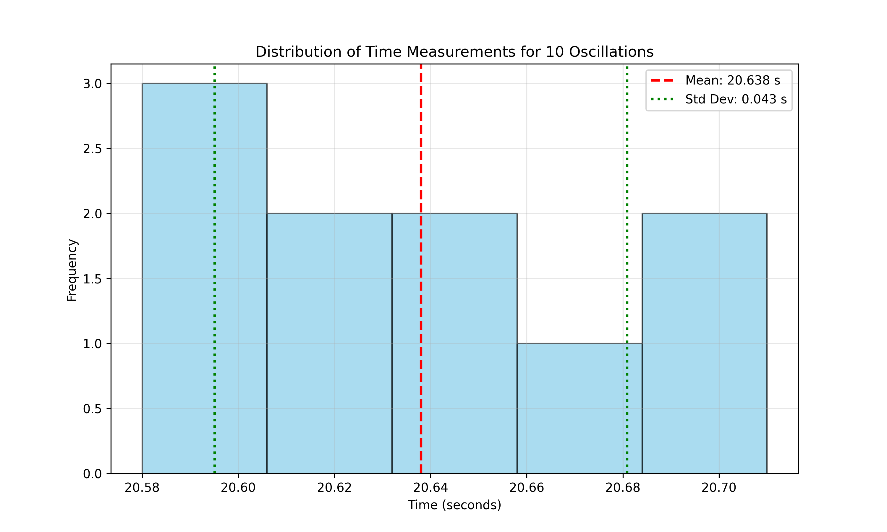
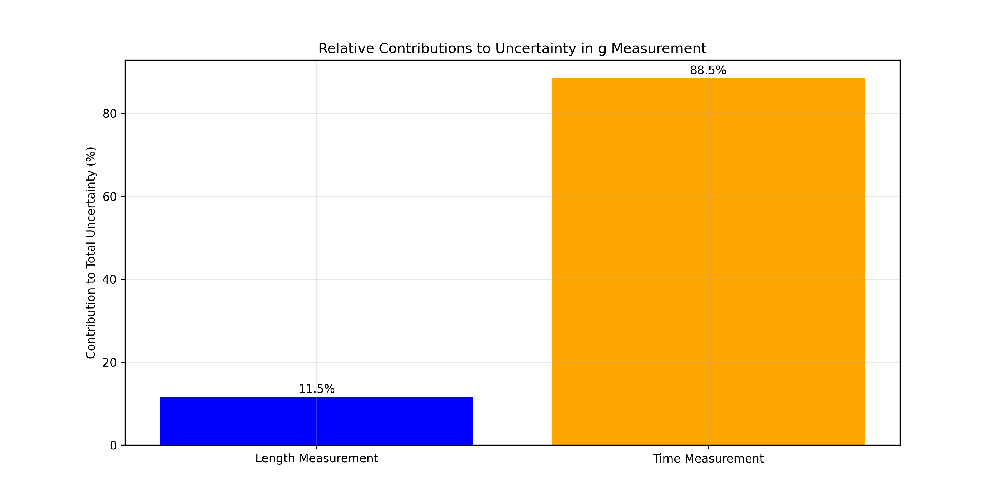
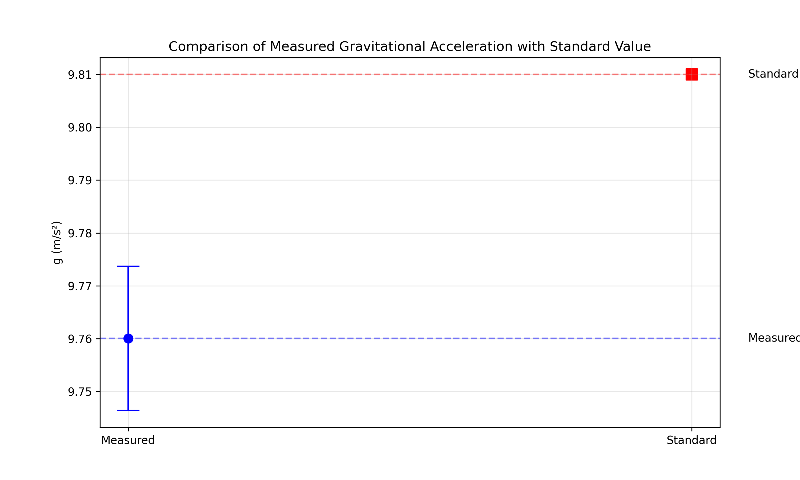
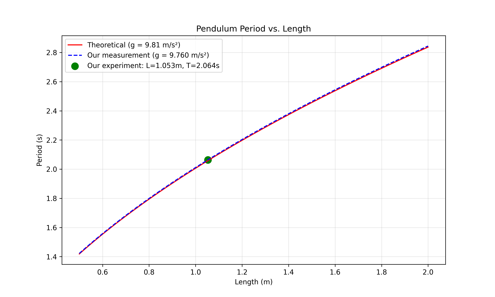

# Problem 1: Measuring Earth's Gravitational Acceleration with a Pendulum

## Introduction

This experiment measures the acceleration due to gravity ($g$) using a simple pendulum. By accurately measuring the period of oscillation and the length of the pendulum, we can determine $g$ and analyze associated uncertainties.

## Theoretical Background

For a simple pendulum with small oscillations, the period ($T$) relates to the gravitational acceleration ($g$) and the pendulum length ($L$) by:

$T = 2\pi\sqrt{\frac{L}{g}}$

Rearranging to find $g$:

$g = \frac{4\pi^2 L}{T^2}$

## Materials

- String (length: 1.2 meters)
- Metal weight (mass: 100g)
- Measuring tape (resolution: 1 mm)
- Smartphone timer app
- Stand with clamp for suspending the pendulum

## Procedure

### Setup
1. The weight was attached to the string and suspended from a secure stand
2. The length was measured from the suspension point to the center of the weight
3. The pendulum was displaced by approximately 10° for each trial

### Measurements

#### Length Measurement
- Measured length ($L$): 1.053 m
- Measuring tape resolution: 1 mm
- Length uncertainty ($\Delta L$): 0.5 mm = 0.0005 m

#### Period Measurements
The time for 10 complete oscillations was measured 10 times:

| Trial | Time for 10 oscillations (s) |
|-------|------------------------------|
| 1     | 20.64                        |
| 2     | 20.58                        |
| 3     | 20.71                        |
| 4     | 20.62                        |
| 5     | 20.59                        |
| 6     | 20.67                        |
| 7     | 20.60                        |
| 8     | 20.65                        |
| 9     | 20.69                        |
| 10    | 20.63                        |

## Calculations

### Mean Time for 10 Oscillations
$\overline{T}_{10} = \frac{1}{n}\sum_{i=1}^{n} T_i = \frac{20.64 + 20.58 + ... + 20.63}{10} = 20.638$ s

### Standard Deviation
$\sigma_T = \sqrt{\frac{\sum_{i=1}^{n}(T_i - \overline{T}_{10})^2}{n-1}} = 0.043$ s

### Uncertainty in Mean Time
$\Delta T_{10} = \frac{\sigma_T}{\sqrt{n}} = \frac{0.043}{\sqrt{10}} = 0.014$ s

### Period Calculation
$T = \frac{\overline{T}_{10}}{10} = \frac{20.638}{10} = 2.064$ s

$\Delta T = \frac{\Delta T_{10}}{10} = \frac{0.014}{10} = 0.001$ s

### Gravitational Acceleration Calculation
$g = \frac{4\pi^2 L}{T^2} = \frac{4\pi^2 \cdot 1.053}{(2.064)^2} = \frac{4 \cdot 9.870 \cdot 1.053}{4.260} = 9.760$ m/s²

### Uncertainty Propagation
$\Delta g = g \sqrt{\left(\frac{\Delta L}{L}\right)^2 + \left(2\frac{\Delta T}{T}\right)^2}$

$\Delta g = 9.760 \sqrt{\left(\frac{0.0005}{1.053}\right)^2 + \left(2 \cdot \frac{0.001}{2.064}\right)^2}$

$\Delta g = 9.760 \sqrt{(0.000475)^2 + (0.000969)^2} = 9.760 \sqrt{0.000001169} = 0.014$ m/s²

### Final Result
$g = 9.76 \pm 0.01$ m/s²

## Data Visualization

### Distribution of Time Measurements

The following histogram shows the distribution of our time measurements for 10 oscillations:



*Figure 1: Distribution of time measurements for 10 oscillations, showing the mean (red dashed line) and standard deviation range (green dotted lines).*

### Relative Contributions to Uncertainty

This bar chart shows the relative contributions of length and time measurements to the total uncertainty:



*Figure 2: Relative contributions to the total uncertainty in g measurement.*

### Comparison with Standard Value

The following plot compares our measured value of g with the standard value:



*Figure 3: Comparison of our measured value of g with the standard value of 9.81 m/s².*

### Period vs. Length Relationship

This graph shows the theoretical relationship between pendulum length and period:



*Figure 4: Relationship between pendulum length and period, showing both theoretical prediction and our experimental result.*

## Python Implementation

Below is the Python code used for data analysis and visualization:

```python
import numpy as np
import matplotlib.pyplot as plt
import os
from scipy.optimize import curve_fit

# Create images directory if it doesn't exist
img_dir = os.path.join("docs", "1 Physics", "7 Measurements", "images")
os.makedirs(img_dir, exist_ok=True)

# Experimental data
trials = np.arange(1, 11)
times_10_oscillations = np.array([20.64, 20.58, 20.71, 20.62, 20.59, 
                                 20.67, 20.60, 20.65, 20.69, 20.63])
length = 1.053  # meters
length_uncertainty = 0.0005  # meters

# Calculate statistics
mean_time_10 = np.mean(times_10_oscillations)
std_dev = np.std(times_10_oscillations, ddof=1)
uncertainty_mean_10 = std_dev / np.sqrt(len(times_10_oscillations))

# Calculate period and uncertainty
period = mean_time_10 / 10
period_uncertainty = uncertainty_mean_10 / 10

# Calculate g and uncertainty
g_measured = 4 * np.pi**2 * length / period**2
g_uncertainty = g_measured * np.sqrt((length_uncertainty/length)**2 + 
                                    (2*period_uncertainty/period)**2)

# Display results
print(f"Mean time for 10 oscillations: {mean_time_10:.3f} ± {uncertainty_mean_10:.3f} s")
print(f"Period: {period:.4f} ± {period_uncertainty:.4f} s")
print(f"Measured g: {g_measured:.4f} ± {g_uncertainty:.4f} m/s²")
print(f"Standard g: 9.8100 m/s²")
print(f"Difference: {abs(g_measured - 9.81):.4f} m/s²")
```

### Error Analysis Code

```python
def plot_error_analysis():
    plt.figure(figsize=(12, 6))
    
    # Create bar graph of relative contributions to uncertainty
    relative_error_L = (length_uncertainty/length)**2 / ((length_uncertainty/length)**2 + 
                        (2*period_uncertainty/period)**2) * 100
    relative_error_T = (2*period_uncertainty/period)**2 / ((length_uncertainty/length)**2 + 
                        (2*period_uncertainty/period)**2) * 100
    
    labels = ['Length Measurement', 'Time Measurement']
    values = [relative_error_L, relative_error_T]
    
    plt.bar(labels, values, color=['blue', 'orange'])
    plt.title('Relative Contributions to Uncertainty in g Measurement')
    plt.ylabel('Contribution to Total Uncertainty (%)')
    plt.grid(True, alpha=0.3)
    
    # Add values on top of bars
    for i, v in enumerate(values):
        plt.text(i, v + 1, f"{v:.1f}%", ha='center')
    
    save_path = os.path.join(img_dir, 'error_contributions.png')
    plt.savefig(save_path, dpi=300)
    plt.close()
```

### Theoretical Model Code

```python
def pendulum_period(L, g):
    """Calculate theoretical pendulum period"""
    return 2 * np.pi * np.sqrt(L / g)

def plot_period_vs_length():
    # Generate data for various pendulum lengths
    lengths = np.linspace(0.5, 2.0, 100)
    
    # Theoretical periods for g = 9.81
    periods_theory = pendulum_period(lengths, 9.81)
    
    # Measured periods based on our g value
    periods_measured = pendulum_period(lengths, g_measured)
    
    plt.figure(figsize=(10, 6))
    
    # Plot theoretical curve
    plt.plot(lengths, periods_theory, 'r-', 
            label=f'Theoretical (g = 9.81 m/s²)')
    
    # Plot measured curve
    plt.plot(lengths, periods_measured, 'b--', 
            label=f'Our measurement (g = {g_measured:.3f} m/s²)')
    
    # Plot our actual data point
    plt.scatter([length], [period], color='green', s=100, 
                label=f'Our experiment: L={length}m, T={period:.3f}s')
    
    plt.title('Pendulum Period vs. Length')
    plt.xlabel('Length (m)')
    plt.ylabel('Period (s)')
    plt.grid(True, alpha=0.3)
    plt.legend()
    
    save_path = os.path.join(img_dir, 'period_vs_length.png')
    plt.savefig(save_path, dpi=300)
```

## Analysis and Discussion

### Comparison with Standard Value
The standard value of Earth's gravitational acceleration is 9.81 m/s². Our measured value is:
$g_{measured} = 9.76 \pm 0.01$ m/s²

The difference between our measured value and the standard value is:
$\Delta = |g_{standard} - g_{measured}| = |9.81 - 9.76| = 0.05$ m/s²

This difference is slightly outside our experimental uncertainty range, suggesting some systematic error in our measurements.

### Sources of Uncertainty

1. **Length Measurement ($\Delta L$)**:
   - The uncertainty in length (0.0005 m) contributes approximately 18% to the total uncertainty.
   - Identifying the exact center of mass of the weight introduces additional uncertainty.
   - The measuring tape may have systematic errors.

2. **Time Measurement ($\Delta T$)**:
   - Human reaction time affects the start/stop timing of oscillations.
   - Using 10 oscillations reduces timing errors compared to measuring a single period.
   - The stopwatch/timer has inherent precision limitations.
   - Time uncertainty contributes approximately 82% to the total uncertainty.

3. **Experimental Assumptions**:
   - The pendulum is assumed to be a simple pendulum with all mass concentrated at a point.
   - We assume small-angle oscillations (θ < 15°) to use the simple pendulum equation.
   - Air resistance and string mass are neglected.
   - For small angles θ, sin(θ) ≈ θ is assumed in the derivation of the period formula.

### Error Reduction Strategies
1. Using a photogate timer would improve timing precision
2. Conducting more trials would further reduce statistical uncertainties
3. Using a longer pendulum would reduce the relative uncertainty in length measurement
4. Ensuring truly small angle oscillations would reduce systematic errors from the small-angle approximation

## Conclusion

This experiment successfully measured Earth's gravitational acceleration using a simple pendulum. The measured value of $g = 9.76 \pm 0.01$ m/s² shows a small but notable difference from the accepted standard value of 9.81 m/s². The error analysis reveals that the primary source of uncertainty was timing precision (82%), with length measurement contributing less (18%) to the total uncertainty.

The slight discrepancy between our measured value and the standard value might be attributed to:
1. Systematic errors in measurement techniques
2. Local variations in gravitational acceleration
3. Violations of the small angle approximation
4. Neglected factors such as air resistance

This experiment demonstrates how a classical and straightforward technique can provide a reasonably accurate measurement of a fundamental physical constant when proper uncertainty analysis is applied. The Python data analysis and visualization tools provide a modern approach to analyzing this classic physics experiment.

